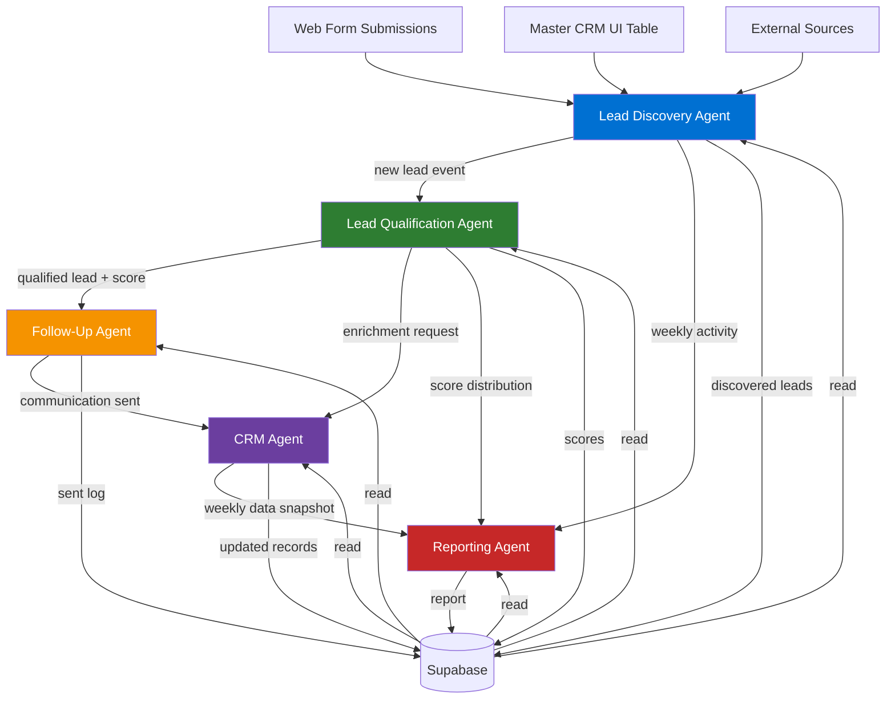

# Agent Architecture — Big Money Realty

> This document defines the full specification for all five agents in the Big Money Realty agentic AI system. Each agent is designed to be implemented using Claude's `tool_use` / function calling API, with Supabase as the persistent memory layer.

---

## Agent Relationships



---

## Agent 1: Lead Discovery Agent

### Objective

Monitor all lead inflow channels — web forms, CRM data imports, and future external sources — and surface new, unprocessed leads to the qualification pipeline. Deduplicate, normalize, and tag leads before passing them downstream.

### Inputs

| Input | Source | Format |
|---|---|---|
| New web form submissions | Supabase `leads` table, `processed = false` | Row records |
| CRM property imports | Supabase `master_crm` table, `agent_reviewed = false` | Row records |
| n8n webhook payloads | `POST /api/webhooks/n8n` | JSON |
| Manual trigger | API call or cron schedule | Empty payload |

### Outputs

| Output | Destination | Description |
|---|---|---|
| Normalized lead record | `leads` table | Cleaned, tagged, deduplicated |
| Discovery action log | `agent_actions` table | What was found, what was created |
| Trigger event | In-memory / queue | Fires Lead Qualification Agent |

### Tool Definitions

```typescript
// Tool: query_new_leads
{
  name: "query_new_leads",
  description: "Query Supabase for unprocessed leads from the web form submissions table",
  input_schema: {
    type: "object",
    properties: {
      limit: {
        type: "number",
        description: "Maximum number of leads to retrieve",
        default: 50
      },
      since_hours: {
        type: "number",
        description: "Only retrieve leads submitted within the last N hours",
        default: 24
      }
    },
    required: []
  }
}

// Tool: query_crm_unreviewed
{
  name: "query_crm_unreviewed",
  description: "Query the Master CRM UI table for properties not yet reviewed by an agent",
  input_schema: {
    type: "object",
    properties: {
      limit: { type: "number", default: 100 },
      filter_distressed: { type: "boolean", description: "If true, prioritize distressed properties" }
    },
    required: []
  }
}

// Tool: normalize_lead
{
  name: "normalize_lead",
  description: "Normalize and clean a raw lead record — standardize phone format, capitalize names, detect lead type from message content",
  input_schema: {
    type: "object",
    properties: {
      lead_id: { type: "string", description: "UUID of the lead record" },
      raw_data: {
        type: "object",
        properties: {
          name: { type: "string" },
          email: { type: "string" },
          phone: { type: "string" },
          message: { type: "string" },
          type: { type: "string" }
        }
      }
    },
    required: ["lead_id", "raw_data"]
  }
}

// Tool: check_duplicate
{
  name: "check_duplicate",
  description: "Check if a lead with this email or phone already exists in the system",
  input_schema: {
    type: "object",
    properties: {
      email: { type: "string" },
      phone: { type: "string" }
    },
    required: []
  }
}

// Tool: mark_lead_discovered
{
  name: "mark_lead_discovered",
  description: "Mark a lead as discovered/processed and write the action log entry",
  input_schema: {
    type: "object",
    properties: {
      lead_id: { type: "string" },
      notes: { type: "string", description: "Agent's observation about this lead" },
      priority: { type: "string", enum: ["high", "medium", "low"] }
    },
    required: ["lead_id", "priority"]
  }
}

// Tool: log_agent_action
{
  name: "log_agent_action",
  description: "Write an action log entry to the agent_actions table",
  input_schema: {
    type: "object",
    properties: {
      agent_name: { type: "string", const: "lead_discovery" },
      action_type: { type: "string", enum: ["discovered", "deduplicated", "normalized", "error"] },
      lead_id: { type: "string" },
      payload: { type: "object" },
      result_summary: { type: "string" }
    },
    required: ["agent_name", "action_type", "result_summary"]
  }
}
```

### Memory Requirements

| Table | Access | Purpose |
|---|---|---|
| `leads` | READ / WRITE | Source of unprocessed leads; updates `processed` flag |
| `master_crm` | READ | Source of CRM property records |
| `agent_actions` | WRITE | Discovery action log |
| `agent_memory` | READ / WRITE | Episodic memory of past discovery runs |

### Evaluation Criteria

| Metric | Target | Measurement |
|---|---|---|
| Leads discovered per run | > 95% of new submissions | Count of `processed=false` rows before vs. after run |
| Duplicate detection rate | < 2% false negatives | Manual spot-check of `leads` table for duplicates |
| Normalization accuracy | > 98% correct phone/name format | Sample audit of 20 records per week |
| Processing latency | < 5 minutes from submission | `submitted_at` vs. `agent_processed_at` delta |

---

## Agent 2: Lead Qualification Agent

### Objective

Analyze each discovered lead against available financial data, behavioral signals, and CRM intelligence to produce a qualification score (0–100) and a recommended next action. Prioritize leads for human follow-up.

### Inputs

| Input | Source | Format |
|---|---|---|
| Normalized lead record | `leads` table | Row record |
| CRM property data | `master_crm` table | Row record (if address match exists) |
| Historical lead scores | `lead_scores` table | Past scoring context |
| Agent memory | `agent_memory` table | Prior reasoning about similar leads |

### Outputs

| Output | Destination | Description |
|---|---|---|
| Lead score record | `lead_scores` table | Score 0–100, tier, reasoning |
| Updated lead status | `leads` table | `status` field updated |
| Qualification action log | `agent_actions` table | Full reasoning trace |
| Trigger for Follow-Up Agent | In-memory | If score >= 40 |

### Tool Definitions

```typescript
// Tool: fetch_lead_with_crm
{
  name: "fetch_lead_with_crm",
  description: "Fetch a lead record and attempt to join with matching CRM property data by address or owner name",
  input_schema: {
    type: "object",
    properties: {
      lead_id: { type: "string" }
    },
    required: ["lead_id"]
  }
}

// Tool: score_lead
{
  name: "score_lead",
  description: "Compute a qualification score for a lead based on available signals",
  input_schema: {
    type: "object",
    properties: {
      lead_id: { type: "string" },
      signals: {
        type: "object",
        properties: {
          has_phone: { type: "boolean" },
          message_length: { type: "number" },
          lead_type: { type: "string", enum: ["buyer", "seller", "valuation", "general"] },
          estimated_equity: { type: "number" },
          is_distressed: { type: "boolean" },
          mortgage_balance: { type: "number" },
          days_since_submission: { type: "number" },
          has_crm_match: { type: "boolean" }
        }
      }
    },
    required: ["lead_id", "signals"]
  }
}

// Tool: classify_lead_tier
{
  name: "classify_lead_tier",
  description: "Classify a lead into a priority tier based on score",
  input_schema: {
    type: "object",
    properties: {
      score: {
        type: "number",
        description: "Score from 0-100"
      }
    },
    required: ["score"]
  }
  // Returns: "hot" (80-100), "warm" (50-79), "nurture" (20-49), "cold" (0-19)
}

// Tool: write_lead_score
{
  name: "write_lead_score",
  description: "Persist the lead qualification score and reasoning to lead_scores table",
  input_schema: {
    type: "object",
    properties: {
      lead_id: { type: "string" },
      score: { type: "number", minimum: 0, maximum: 100 },
      tier: { type: "string", enum: ["hot", "warm", "nurture", "cold"] },
      reasoning: { type: "string", description: "Agent's plain-language explanation of the score" },
      recommended_action: { type: "string", description: "e.g., 'Call within 1 hour', 'Send listing email', 'Add to drip campaign'" },
      signals_used: { type: "object" }
    },
    required: ["lead_id", "score", "tier", "reasoning", "recommended_action"]
  }
}

// Tool: update_lead_status
{
  name: "update_lead_status",
  description: "Update the status field on a lead record",
  input_schema: {
    type: "object",
    properties: {
      lead_id: { type: "string" },
      status: { type: "string", enum: ["new", "qualified", "contacted", "nurture", "closed", "dead"] }
    },
    required: ["lead_id", "status"]
  }
}
```

### Scoring Rubric

| Signal | Points | Rationale |
|---|---|---|
| Lead type = seller | +20 | Sellers are transactional and ready to act |
| Lead type = buyer | +15 | Buyers have clear intent |
| Phone number provided | +15 | Willingness to be contacted |
| Message length > 50 chars | +10 | Higher engagement signal |
| Has CRM property match | +20 | Property intelligence available |
| Estimated equity > $100k | +15 | High financial motivation |
| Is distressed property | +10 | Urgency present |
| Submitted within 24 hours | +5 | Recency bonus |
| Lead type = valuation | +10 | Considering sale |

### Memory Requirements

| Table | Access | Purpose |
|---|---|---|
| `leads` | READ / WRITE | Lead records; updates status |
| `master_crm` | READ | Property intelligence join |
| `lead_scores` | WRITE | Persists scoring output |
| `agent_actions` | WRITE | Qualification reasoning log |
| `agent_memory` | READ / WRITE | Semantic memory about lead patterns |

### Evaluation Criteria

| Metric | Target | Measurement |
|---|---|---|
| Score accuracy (human agreement) | > 80% | Weekly sample review by Damian |
| Hot lead identification rate | > 70% precision | Track hot leads that converted vs. total hot |
| False negative rate (missed hot leads) | < 10% | Manual review of "cold" leads that converted |
| Score computation time | < 10 seconds per lead | Logged in `agent_actions` |

---

## Agent 3: Follow-Up Agent

### Objective

For qualified leads (score >= 40), draft and schedule personalized follow-up communications. Adapt tone and content based on lead tier, type, and any available property data. Log all drafts for human review before sending.

### Inputs

| Input | Source | Format |
|---|---|---|
| Qualified lead record | `leads` + `lead_scores` tables | Joined record |
| CRM property data | `master_crm` table | If available |
| Follow-up history | `followups` table | Prior contact attempts |
| Agent memory | `agent_memory` | Successful messaging patterns |

### Outputs

| Output | Destination | Description |
|---|---|---|
| Draft email/SMS | `followups` table | Status = `draft`, awaiting human approval |
| Scheduled follow-up | `followups` table | Status = `scheduled` after human approval |
| Follow-up action log | `agent_actions` table | What was drafted and why |

### Tool Definitions

```typescript
// Tool: fetch_qualified_leads_pending_followup
{
  name: "fetch_qualified_leads_pending_followup",
  description: "Fetch leads that are qualified but have no scheduled follow-up yet",
  input_schema: {
    type: "object",
    properties: {
      tier_filter: { type: "string", enum: ["hot", "warm", "nurture", "all"], default: "all" },
      limit: { type: "number", default: 20 }
    }
  }
}

// Tool: draft_email
{
  name: "draft_email",
  description: "Draft a personalized follow-up email for a lead using available context",
  input_schema: {
    type: "object",
    properties: {
      lead_id: { type: "string" },
      lead_name: { type: "string" },
      lead_type: { type: "string" },
      tier: { type: "string" },
      property_address: { type: "string", description: "If CRM match exists" },
      estimated_equity: { type: "number", description: "If available" },
      is_distressed: { type: "boolean" },
      original_message: { type: "string" },
      broker_name: { type: "string", const: "Damian Einbinder" }
    },
    required: ["lead_id", "lead_name", "lead_type", "tier", "broker_name"]
  }
  // Returns: { subject: string, body: string, tone: string }
}

// Tool: draft_sms
{
  name: "draft_sms",
  description: "Draft a short personalized SMS follow-up message (max 160 chars)",
  input_schema: {
    type: "object",
    properties: {
      lead_id: { type: "string" },
      lead_name: { type: "string" },
      tier: { type: "string" },
      lead_type: { type: "string" },
      broker_name: { type: "string", const: "Damian Einbinder" }
    },
    required: ["lead_id", "lead_name", "tier", "lead_type", "broker_name"]
  }
  // Returns: { body: string }
}

// Tool: schedule_followup
{
  name: "schedule_followup",
  description: "Write a follow-up record to the followups table with draft content",
  input_schema: {
    type: "object",
    properties: {
      lead_id: { type: "string" },
      channel: { type: "string", enum: ["email", "sms", "call"] },
      subject: { type: "string", description: "Email subject (if channel=email)" },
      body: { type: "string" },
      scheduled_for: { type: "string", format: "date-time" },
      status: { type: "string", enum: ["draft", "scheduled", "sent", "failed"], default: "draft" },
      requires_human_approval: { type: "boolean", default: true }
    },
    required: ["lead_id", "channel", "body", "scheduled_for"]
  }
}

// Tool: check_followup_history
{
  name: "check_followup_history",
  description: "Check prior follow-up attempts for a lead to avoid duplicate contact",
  input_schema: {
    type: "object",
    properties: {
      lead_id: { type: "string" },
      last_n_days: { type: "number", default: 30 }
    },
    required: ["lead_id"]
  }
}
```

### Follow-Up Templates by Tier

| Tier | Channel | Timing | Tone |
|---|---|---|---|
| Hot | SMS | Within 1 hour | Direct, urgent, personal |
| Hot | Email | Within 2 hours | Detailed, data-backed |
| Warm | Email | Within 24 hours | Helpful, informative |
| Warm | SMS | Day 3 if no response | Brief, low-pressure |
| Nurture | Email | Day 7 | Educational, no pressure |
| Nurture | Email (drip) | Day 30 | Market update |

### Memory Requirements

| Table | Access | Purpose |
|---|---|---|
| `leads` | READ | Lead contact info and context |
| `lead_scores` | READ | Tier and recommended action |
| `master_crm` | READ | Property data for personalization |
| `followups` | READ / WRITE | Draft and schedule follow-ups |
| `agent_actions` | WRITE | Communication draft log |
| `agent_memory` | READ / WRITE | High-performing message patterns |

### Evaluation Criteria

| Metric | Target | Measurement |
|---|---|---|
| Draft quality (human rating) | >= 4/5 stars | Damian rates each batch weekly |
| Personalization rate | 100% of hot/warm leads | Presence of name, property, or context |
| Draft-to-sent conversion | > 85% | `followups` table: drafted vs. approved |
| Response rate (downstream) | > 25% for hot leads | Track reply/call back against sent |

---

## Agent 4: CRM Agent

### Objective

Maintain the integrity and completeness of CRM records. Detect data quality issues, flag incomplete or stale records, enrich records when new information is available, and maintain a normalized view of all property intelligence.

### Inputs

| Input | Source | Format |
|---|---|---|
| Master CRM UI table | Supabase | 80+ field property records |
| New lead contact info | `leads` table | Name, email, phone |
| Follow-up outcomes | `followups` table | Sent, replied, bounced flags |
| Agent action logs | `agent_actions` table | Enrichment triggers |

### Outputs

| Output | Destination | Description |
|---|---|---|
| Updated CRM record | `master_crm` table | Enriched or corrected fields |
| Data quality report | `agent_actions` table | List of issues detected |
| Merge suggestion | `agent_memory` table | Proposed deduplication |
| Alert | `agent_actions` table | High-priority record flag |

### Tool Definitions

```typescript
// Tool: audit_crm_record
{
  name: "audit_crm_record",
  description: "Audit a CRM record for completeness, flag missing high-value fields",
  input_schema: {
    type: "object",
    properties: {
      crm_id: { type: "number" },
      fields_to_check: {
        type: "array",
        items: { type: "string" },
        description: "Specific fields to audit, or empty for full audit",
        default: []
      }
    },
    required: ["crm_id"]
  }
  // Returns: { completeness_score: number, missing_fields: string[], issues: string[] }
}

// Tool: enrich_crm_from_lead
{
  name: "enrich_crm_from_lead",
  description: "Update a CRM record with contact information found in a matching web lead",
  input_schema: {
    type: "object",
    properties: {
      crm_id: { type: "number" },
      lead_id: { type: "string" },
      fields_to_merge: {
        type: "array",
        items: { type: "string", enum: ["email", "phone", "notes", "lead_status"] }
      }
    },
    required: ["crm_id", "lead_id", "fields_to_merge"]
  }
}

// Tool: flag_high_opportunity
{
  name: "flag_high_opportunity",
  description: "Flag a CRM record as a high-priority opportunity for Damian's review",
  input_schema: {
    type: "object",
    properties: {
      crm_id: { type: "number" },
      reason: { type: "string" },
      opportunity_type: {
        type: "string",
        enum: ["high_equity_seller", "distressed_property", "expired_listing", "investor_target"]
      }
    },
    required: ["crm_id", "reason", "opportunity_type"]
  }
}

// Tool: update_lead_status_crm
{
  name: "update_lead_status_crm",
  description: "Update the lead_status field on a CRM record",
  input_schema: {
    type: "object",
    properties: {
      crm_id: { type: "number" },
      new_status: { type: "string" },
      notes: { type: "string" }
    },
    required: ["crm_id", "new_status"]
  }
}

// Tool: detect_duplicates_crm
{
  name: "detect_duplicates_crm",
  description: "Scan the master_crm table for likely duplicate records based on address or owner name similarity",
  input_schema: {
    type: "object",
    properties: {
      similarity_threshold: { type: "number", minimum: 0.7, maximum: 1.0, default: 0.85 }
    }
  }
  // Returns: { duplicate_pairs: Array<{ id1: number, id2: number, confidence: number, reason: string }> }
}
```

### Memory Requirements

| Table | Access | Purpose |
|---|---|---|
| `master_crm` | READ / WRITE | Primary data source and update target |
| `leads` | READ | Contact info enrichment source |
| `followups` | READ | Communication outcome tracking |
| `agent_actions` | WRITE | Audit and enrichment logs |
| `agent_memory` | READ / WRITE | Procedural memory of enrichment patterns |

### Evaluation Criteria

| Metric | Target | Measurement |
|---|---|---|
| CRM completeness score | > 80% average | Audit score across all records weekly |
| Records enriched per week | > 10% of active pipeline | Count of `enrich_crm_from_lead` calls |
| Duplicate detection accuracy | > 90% precision | Manual review of flagged pairs |
| High-opportunity flags accepted | > 60% agreement | Damian acceptance rate of flags |

---

## Agent 5: Reporting Agent

### Objective

Generate structured weekly summaries, performance reports, and market insights from all system data. Produce reports that help Damian make better business decisions without having to read raw data.

### Inputs

| Input | Source | Format |
|---|---|---|
| All leads from past 7 days | `leads` table | Aggregated |
| Lead scores | `lead_scores` table | Distribution data |
| Follow-up outcomes | `followups` table | Sent, opened, replied |
| Agent actions | `agent_actions` table | Activity summary |
| CRM aggregate data | `master_crm` table | Portfolio metrics |

### Outputs

| Output | Destination | Description |
|---|---|---|
| Weekly report | `reports` table | Structured JSON + narrative |
| KPI snapshot | `reports` table | Numeric metrics for dashboard |
| Market insight | `reports` table | CRM-derived market observations |
| Alert summary | `agent_memory` table | Patterns requiring attention |

### Tool Definitions

```typescript
// Tool: aggregate_lead_activity
{
  name: "aggregate_lead_activity",
  description: "Aggregate lead submission and qualification data for a given time window",
  input_schema: {
    type: "object",
    properties: {
      start_date: { type: "string", format: "date" },
      end_date: { type: "string", format: "date" }
    },
    required: ["start_date", "end_date"]
  }
  // Returns: { total: number, by_type: object, by_tier: object, avg_score: number }
}

// Tool: aggregate_followup_performance
{
  name: "aggregate_followup_performance",
  description: "Summarize follow-up activity and response rates",
  input_schema: {
    type: "object",
    properties: {
      start_date: { type: "string", format: "date" },
      end_date: { type: "string", format: "date" }
    },
    required: ["start_date", "end_date"]
  }
  // Returns: { drafted: number, sent: number, response_rate: number }
}

// Tool: compute_portfolio_metrics
{
  name: "compute_portfolio_metrics",
  description: "Compute aggregate metrics from the CRM property intelligence table",
  input_schema: {
    type: "object",
    properties: {
      include_distressed: { type: "boolean", default: true }
    }
  }
  // Returns: { total_records: number, avg_value: number, total_equity: number, distressed_count: number }
}

// Tool: write_report
{
  name: "write_report",
  description: "Write a formatted report to the reports table",
  input_schema: {
    type: "object",
    properties: {
      report_type: { type: "string", enum: ["weekly_summary", "lead_performance", "market_insight", "portfolio_snapshot"] },
      period_start: { type: "string", format: "date" },
      period_end: { type: "string", format: "date" },
      headline: { type: "string" },
      narrative: { type: "string", description: "Plain-language summary for Damian" },
      metrics: { type: "object" },
      recommendations: { type: "array", items: { type: "string" } }
    },
    required: ["report_type", "period_start", "period_end", "headline", "narrative", "metrics"]
  }
}

// Tool: detect_anomalies
{
  name: "detect_anomalies",
  description: "Identify unusual patterns in lead volume, score distribution, or follow-up performance compared to prior periods",
  input_schema: {
    type: "object",
    properties: {
      metric: { type: "string", enum: ["lead_volume", "score_distribution", "response_rate", "crm_completeness"] },
      current_period_data: { type: "object" },
      baseline_period_data: { type: "object" }
    },
    required: ["metric", "current_period_data", "baseline_period_data"]
  }
}
```

### Report Structure

Each weekly report includes:

1. **Executive Headline** — one-sentence summary
2. **Lead Volume** — total, by type, by tier
3. **Pipeline Health** — score distribution, stale leads
4. **Follow-Up Performance** — drafted, sent, response rate
5. **CRM Portfolio Snapshot** — total records, avg equity, distressed count
6. **Anomaly Flags** — anything unusual vs. prior week
7. **Top 3 Recommendations** — actionable items for Damian

### Memory Requirements

| Table | Access | Purpose |
|---|---|---|
| `leads` | READ | Lead activity data |
| `lead_scores` | READ | Scoring distribution |
| `followups` | READ | Communication performance |
| `agent_actions` | READ | Agent activity summary |
| `master_crm` | READ | Portfolio intelligence |
| `reports` | WRITE | Report storage |
| `agent_memory` | READ / WRITE | Baseline patterns for anomaly detection |

### Evaluation Criteria

| Metric | Target | Measurement |
|---|---|---|
| Report completeness | All 7 sections populated | Automated schema validation |
| Recommendation acceptance | > 50% acted on | Damian tracks which items he acts on |
| Anomaly precision | < 20% false positives | Review of flagged anomalies vs. actual issues |
| Report generation time | < 60 seconds | Logged in `agent_actions` |

---

## Implementation Notes

### Claude API Pattern for Tool Use

All agents use the following pattern when calling the Anthropic API:

```typescript
const response = await anthropic.messages.create({
  model: "claude-sonnet-4-5-20251001",
  max_tokens: 4096,
  tools: AGENT_TOOLS,          // Tool definitions array
  tool_choice: { type: "auto" },
  system: AGENT_SYSTEM_PROMPT,
  messages: [
    { role: "user", content: agentTask }
  ]
});

// Handle tool_use blocks
if (response.stop_reason === "tool_use") {
  for (const block of response.content) {
    if (block.type === "tool_use") {
      const result = await executeTool(block.name, block.input);
      // Continue conversation with tool result
    }
  }
}
```

### Tool Execution Pattern

```typescript
async function executeTool(
  name: string,
  input: Record<string, unknown>
): Promise<unknown> {
  function getSupabase() {
    return createClient(
      process.env.SUPABASE_URL!,
      process.env.SUPABASE_ANON_KEY!
    );
  }
  // Route to appropriate handler
  switch (name) {
    case "query_new_leads": return queryNewLeads(input, getSupabase());
    case "score_lead": return scoreLead(input);
    case "write_lead_score": return writeLeadScore(input, getSupabase());
    // ...
  }
}
```

### Human-in-the-Loop Gates

The following agent actions require human approval before execution:

| Agent | Action | Gate |
|---|---|---|
| Follow-Up | Send email | Damian approves draft in dashboard |
| Follow-Up | Send SMS | Damian approves draft in dashboard |
| CRM | Merge/delete duplicate | Manual confirmation |
| CRM | Flag opportunity | Informational only, no auto-action |
| Reporting | No gate required | Reports are read-only |
