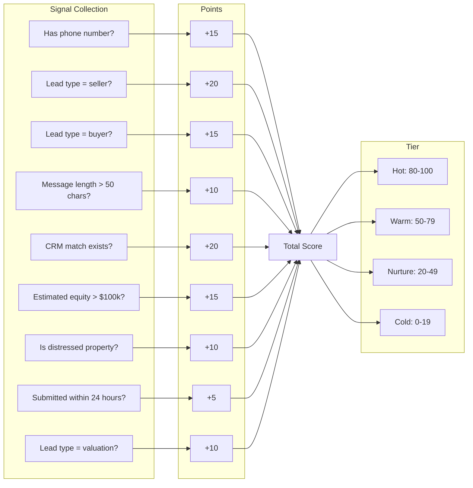
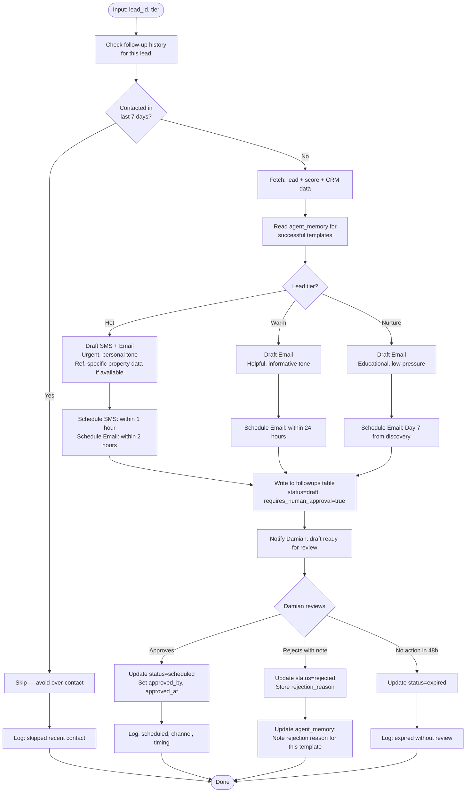
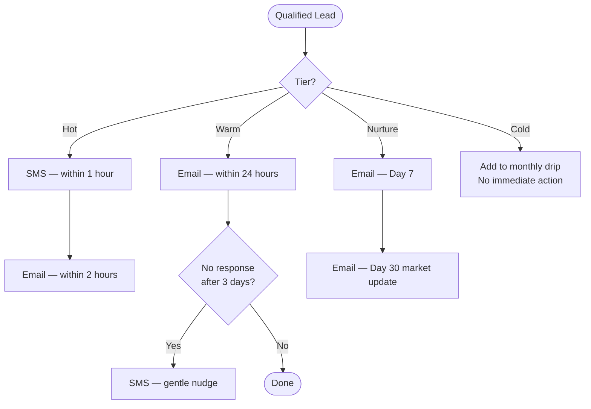
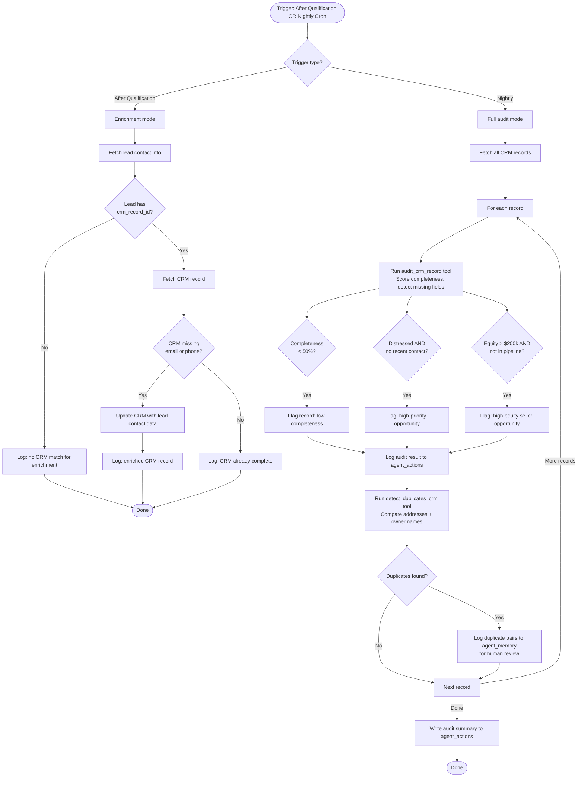
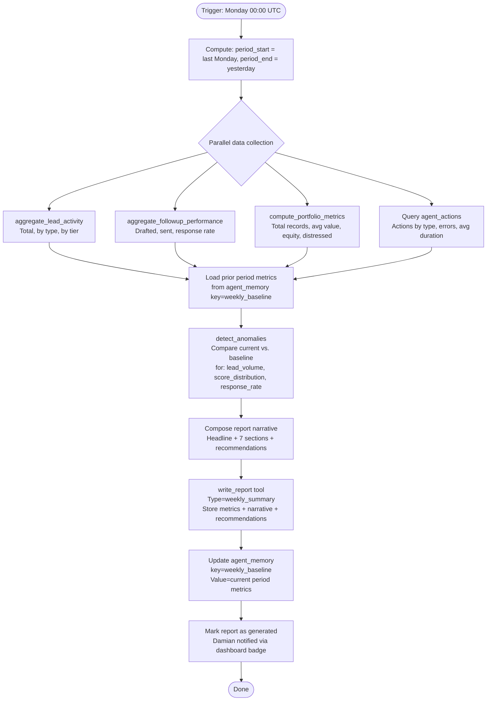
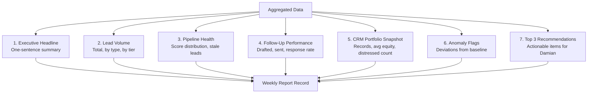
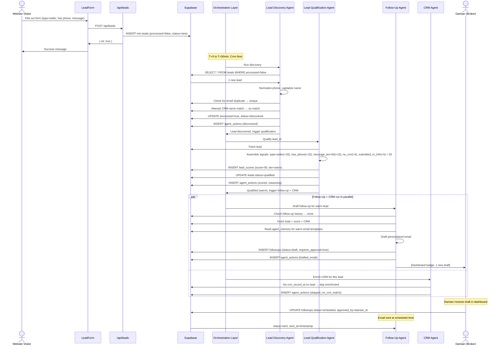
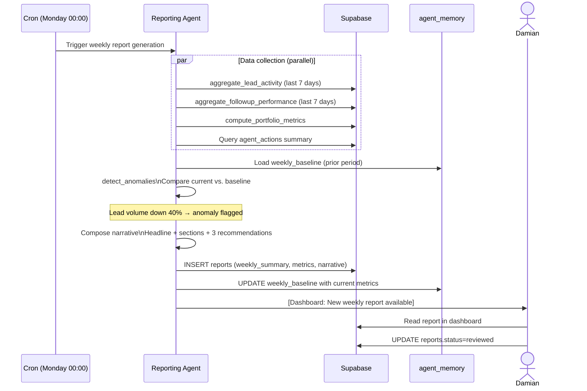
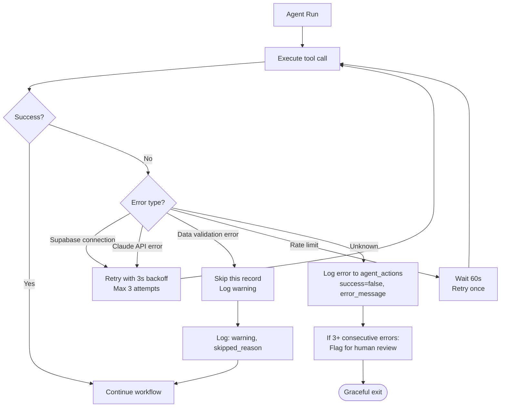

# Agent Workflows — Big Money Realty

> Step-by-step workflow diagrams for each agent and the full multi-agent orchestration pipeline.

---

## 1. Lead Discovery Workflow

### Overview

The Lead Discovery Agent runs on a schedule (every 30 minutes) and on-demand via webhook. Its job is to normalize, deduplicate, and tag all new inbound leads so they are ready for the Qualification Agent.

```mermaid
flowchart TD
    START([Trigger: Cron or Webhook]) --> FETCH[Query leads WHERE processed = false]
    FETCH --> EMPTY{Any new leads?}
    EMPTY -->|No| LOG_EMPTY[Log: 0 leads discovered]
    LOG_EMPTY --> END([Done])

    EMPTY -->|Yes| LOOP[For each unprocessed lead]
    LOOP --> NORM[Normalize: phone format, capitalize name, detect intent from message]

    NORM --> DUP_CHECK[Check: does email or phone already exist?]
    DUP_CHECK -->|Duplicate found| MARK_DUP[Mark as duplicate, link to original record]
    MARK_DUP --> LOG_DUP[Log: deduplicated]
    LOG_DUP --> NEXT[Next lead]

    DUP_CHECK -->|Unique| CRM_MATCH[Attempt CRM address or name match]
    CRM_MATCH -->|Match found| LINK_CRM[Set crm_record_id on lead]
    CRM_MATCH -->|No match| CONTINUE[Continue]

    LINK_CRM --> PRIORITY[Determine priority based on type + CRM match]
    CONTINUE --> PRIORITY

    PRIORITY --> MARK_DISC[Update: processed=true, status=discovered, agent_processed_at=now()]
    MARK_DISC --> LOG_DISC[Write to agent_actions: discovered]
    LOG_DISC --> TRIGGER_LQA[Trigger Lead Qualification Agent for this lead]
    TRIGGER_LQA --> NEXT

    NEXT -->|More leads| LOOP
    NEXT -->|Done| SUMMARY[Write run summary to agent_actions]
    SUMMARY --> END
```

### Key Decision Points

| Decision | Yes Path | No Path |
|---|---|---|
| Any new leads? | Process each lead | Log 0 and exit |
| Duplicate by email/phone? | Mark duplicate, skip qualification | Continue to normalize |
| CRM address match? | Link `crm_record_id` | Proceed without CRM data |

---

## 2. Lead Qualification Workflow

### Overview

The Qualification Agent receives a lead after Discovery. It evaluates all available signals — including CRM property data if linked — and produces a 0–100 score and tier classification.

```mermaid
flowchart TD
    START([Input: lead_id]) --> FETCH[Fetch lead record]
    FETCH --> CRM{crm_record_id set?}

    CRM -->|Yes| FETCH_CRM[Fetch CRM record with financial + property data]
    CRM -->|No| NO_CRM[Proceed with lead data only]

    FETCH_CRM --> SIGNALS[Assemble signals object]
    NO_CRM --> SIGNALS

    SIGNALS --> SCORE[Invoke score_lead tool\nEvaluate: type, phone, message, equity, distress, recency, CRM match]

    SCORE --> CLASSIFY[Invoke classify_lead_tier tool\n80-100: hot | 50-79: warm | 20-49: nurture | 0-19: cold]

    CLASSIFY --> RECOMMEND[Determine recommended_action based on tier and signals]

    RECOMMEND --> WRITE_SCORE[Write to lead_scores table:\nscore, tier, signals, reasoning, recommended_action]

    WRITE_SCORE --> UPDATE_LEAD[Update leads.status = qualified]

    UPDATE_LEAD --> LOG[Write to agent_actions: scored, reasoning trace, tokens_used]

    LOG --> CHECK_THRESHOLD{Score >= 40?}

    CHECK_THRESHOLD -->|Yes| TRIGGER_FUA[Trigger Follow-Up Agent]
    CHECK_THRESHOLD -->|No| COLD_QUEUE[Add to nurture queue / no immediate action]

    TRIGGER_FUA --> TRIGGER_CRMA[Trigger CRM Agent for enrichment]
    COLD_QUEUE --> TRIGGER_CRMA

    TRIGGER_CRMA --> END([Done])
```

### Scoring Signal Evaluation



---

## 3. Follow-Up Workflow

### Overview

The Follow-Up Agent drafts personalized communications for qualified leads. All drafts require human approval before sending.



### Follow-Up Channel Selection



---

## 4. CRM Agent Workflow

### Overview

The CRM Agent runs alongside the qualification pipeline and on a nightly schedule to maintain data quality across all property records.



---

## 5. Reporting Workflow

### Overview

The Reporting Agent runs every Monday morning (00:00 UTC) to generate the weekly summary report for Damian.



### Report Section Composition



---

## 6. Multi-Agent Orchestration Flow

### Full Pipeline: Lead Submission to Communication Draft



### Weekly Reporting Cycle



---

## Error Handling

Every workflow includes error handling at the agent level:


