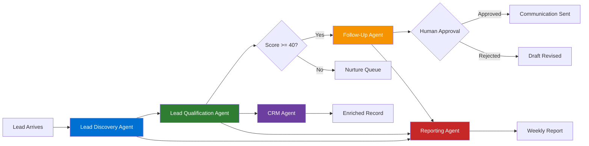

# Case Study: AI-Native Real Estate Operations at Big Money Realty

> **Organization:** Big Money Realty, Las Vegas, NV  
> **Operator:** Damian Einbinder, Broker-Owner  
> **Project Type:** Agentic AI system design and phased implementation  
> **Status:** Phase 1 deployed; Phases 2–5 in design

---

## Executive Summary

Big Money Realty is a single-broker real estate operation in Las Vegas with nearly a decade of market presence. Like most independent brokers, Damian Einbinder operates with minimal staff, relying on personal effort for lead follow-up, CRM management, and market analysis. The operational bottleneck is not leads — it is the time and consistency required to act on them.

This case study documents the architecture and rationale behind transforming Big Money Realty from a traditional web presence into an **AI-native real estate operation** — one where five specialized agents handle discovery, qualification, communication drafting, CRM maintenance, and reporting, while Damian focuses on the human-facing work only he can do: building relationships, negotiating, and closing.

The result is not the replacement of a real estate broker. It is the amplification of one.

---

## Problem Statement

### The Operational Reality of a Solo Broker

Independent brokers face a structural disadvantage that no amount of hustle fully solves. The same activities that generate leads — open houses, social media, referrals, advertising — are also the activities that consume the time needed to follow up on those leads. The result is a leaky pipeline:

- Leads come in from web forms, referrals, and market outreach
- Some receive a response within hours; others within days; some never
- CRM records are updated inconsistently
- Follow-up quality varies based on how much energy Damian has that day
- No systematic reporting means patterns are invisible until they're already costly

This is not a discipline problem. It is a systems problem.

### The Data Opportunity

The Big Money Realty Supabase CRM contains over 80 fields of property intelligence per record:

- Owner identity (name, spouse, contact info)
- Financial data (estimated value, equity, mortgage balance, CLTV)
- Property characteristics (beds, baths, sqft, year, pool, parking)
- Market data (comparable sales, avg DOM, list-to-sale ratios)
- Distress signals (NOD dates, auction dates, delinquent amounts)
- Lien data (1st and 2nd position, lender, borrower, dates)
- Transaction history (last sale date, price, buyer, seller)

This data is currently used reactively — Damian looks up a record when he's already on the phone with someone. The agents are designed to make this data work proactively: surfacing opportunities, flagging urgent cases, and informing every communication before it's sent.

---

## Solution Architecture

### Design Principle

The system is designed around one principle: **every agent should make Damian more effective, not replace his judgment**.

Agents handle volume and consistency. Damian handles relationships and decisions. The agents never send a message, delete a record, or take an irreversible action without a human approval step.

### The Five-Agent Pipeline



### Technology Decisions

| Decision | Choice | Rationale |
|---|---|---|
| AI model | Claude (Haiku → Sonnet) | Best-in-class instruction following, tool use reliability, safety |
| Memory store | Supabase (PostgreSQL) | Already in stack, relational model suits lead + CRM data |
| Framework | Next.js 16 | Already in stack, API routes simplify agent endpoints |
| Agent trigger | Cron + webhook | Deterministic scheduling, no always-on polling cost |
| Deployment | Vercel | Zero-ops, auto-deploy from main, existing infrastructure |

---

## Business Outcomes (Projected)

These projections are based on industry benchmarks for real estate lead follow-up conversion and the specific data characteristics of the Big Money Realty pipeline.

### Current Baseline (Estimated)

| Metric | Estimated Current |
|---|---|
| Lead response time (avg) | 4–12 hours |
| Leads followed up on within 24 hours | 60% |
| CRM records with complete contact info | 45% |
| Weekly time spent on CRM management | 3–5 hours |
| Follow-up consistency across all leads | Inconsistent |

### Projected Post-Agent State

| Metric | Projected Outcome | Basis |
|---|---|---|
| Lead response time (draft ready) | < 15 minutes | Automation benchmark |
| Hot leads contacted within 1 hour | 95%+ | Agent triggers on qualification |
| CRM completeness score | > 80% | CRM Agent continuous enrichment |
| Weekly CRM management time | < 30 minutes (review only) | Full automation of data tasks |
| Follow-up consistency | 100% of qualified leads | Systematic, not effort-dependent |

### Revenue Impact Model

Assuming:
- Current lead volume: ~20 web leads/month + 50 CRM records/month
- Current hot lead conversion: 8% (of contacted leads) → ~2 closed deals/month
- Average commission per deal: $7,500
- Projected improvement from systematic follow-up: 30% increase in hot lead conversion

**Projected additional annual revenue: ~$54,000** from improved follow-up alone — before accounting for CRM opportunity surfacing.

---

## Technical Implementation Details

### Phase 1: Foundation (Current)

The platform is live at bigmoneyrealty.com with:

- **`app/api/chat/route.ts`** — Claude Haiku chat agent with system prompt defining Damian's persona, Las Vegas market knowledge, and lead qualification behavior. Maintains last 10 messages of conversation history. Deployed and active.

- **`components/AIChatWidget.tsx`** — Floating chat widget with animated pulse indicator, conversation history, starter prompts, and error handling. Integrated on all pages.

- **`components/LeadForm.tsx`** — Four-type lead form (buyer/seller/valuation/general) with n8n webhook relay, Supabase storage, and success/error states.

- **`app/dashboard/page.tsx`** — Password-protected CRM dashboard with two views: web leads (from `Master` table) and property intelligence (from `Master CRM UI` table with 80+ fields). Full CMA detail panel with financial data, liens, comparables, and distress flags.

- **Supabase tables live:** `Master` (web leads) and `Master CRM UI` (property intelligence)

### Phase 2 Target: Single-Agent Qualification

The Lead Qualification Agent is the highest-ROI first agent to implement:

```typescript
// /app/api/agents/qualify/route.ts
export async function POST(req: NextRequest) {
  const { lead_id } = await req.json();
  
  // 1. Fetch lead + CRM match
  const lead = await fetchLeadWithCRM(lead_id);
  
  // 2. Run qualification agent
  const result = await runAgent({
    model: "claude-sonnet-4-5-20251001",
    tools: QUALIFICATION_TOOLS,
    systemPrompt: QUALIFICATION_SYSTEM_PROMPT,
    task: `Qualify lead ${lead_id}: ${JSON.stringify(lead)}`
  });
  
  // 3. Result is already persisted via tool calls
  return NextResponse.json({ score: result.score, tier: result.tier });
}
```

### Data Architecture

The current Supabase `Master CRM UI` table contains fields that are directly usable as agent signals without any additional data collection:

| Field | Agent Use |
|---|---|
| `estimated_equity` | Qualification scoring (+15 if > $100k) |
| `is_distressed` | Qualification scoring (+10), Priority flagging |
| `estimated_value` | Follow-up personalization ("your home worth $X") |
| `nod_date` + `auction_date` | Urgency scoring for distressed outreach |
| `lien_1_amount` + `lien_2_amount` | Equity calculation verification |
| `avg_comp_sale_price` | Market context in follow-up emails |
| `market_avg_dom` | Market positioning in communications |

---

## Lessons Learned

### What Works Well in Phase 1

1. **The chat widget generates warm leads.** The Claude Haiku system prompt is effective at qualifying intent and directing motivated leads to the form. The conversational interface lowers the friction compared to a static form.

2. **The CRM dashboard surfaces real opportunities.** The distress flag filter and equity sorting make it easy to identify high-priority outreach targets in seconds. This is immediate value from the 80+ field data model.

3. **Lazy Supabase initialization prevents deployment failures.** The `getSupabase()` factory pattern (not module-level initialization) prevents Next.js build failures when environment variables are absent — a critical pattern for production Next.js with external services.

### What Phase 1 Reveals as the Next Problem

1. **Dashboard is reactive, not proactive.** Damian has to log in and look at the data. The agents are designed to push insights to him — flipping the model from pull to push.

2. **Follow-up is still manual.** The forms capture leads into Supabase, but nothing happens automatically. The window between lead submission and first contact is entirely dependent on Damian's availability.

3. **Scoring requires human cognitive load.** Looking at a CRM record and deciding whether to call that person requires reading 80 fields and making a judgment call. The Qualification Agent offloads that to Claude.

---

## Transferability to Other Industries

The architecture designed for Big Money Realty is intentionally generic at the infrastructure level. The same five-agent pattern applies directly to:

### Mortgage Brokerage

| Agent | Adaptation |
|---|---|
| Lead Discovery | Monitor application forms, pre-qual requests |
| Qualification | Score based on credit range, LTV, loan type |
| Follow-Up | Draft rate lock reminders, document request emails |
| CRM | Maintain loan pipeline records, flag expiring pre-approvals |
| Reporting | Weekly pipeline report, pull-through rate analysis |

### Insurance Agency

| Agent | Adaptation |
|---|---|
| Lead Discovery | Monitor quote requests, referral form submissions |
| Qualification | Score based on coverage type, premium range, risk profile |
| Follow-Up | Draft quote follow-up, renewal reminders |
| CRM | Track policy renewals, coverage gaps |
| Reporting | Retention rate, premium volume, loss ratio summary |

### Legal Practice (Client Intake)

| Agent | Adaptation |
|---|---|
| Lead Discovery | Monitor intake forms, consultation requests |
| Qualification | Evaluate case type, statute of limitations urgency |
| Follow-Up | Draft consultation scheduling, document request emails |
| CRM | Maintain client records, flag deadline proximity |
| Reporting | Weekly intake volume, case type distribution |

### What Transfers Directly

- The Supabase memory architecture (all 8 tables)
- The tool calling patterns for each agent type
- The human-in-the-loop gate for communications
- The evaluation framework metrics (adapted for domain)
- The Next.js + Vercel deployment infrastructure

### What Must Be Adapted

- System prompts (domain knowledge, persona)
- Scoring rubric (signals relevant to the industry)
- Follow-up templates (tone, content, channel preferences)
- CRM schema (domain-specific fields)

---

## Conclusion

Big Money Realty demonstrates that agentic AI is not a luxury reserved for large enterprises with engineering teams. A single-broker real estate operation with a modern web stack and a Supabase database has everything needed to implement a five-agent system that handles the full lead lifecycle autonomously — with human oversight at every decision point that matters.

The architecture is designed to grow with the business. Phase 1 is a foundation. The agents are the operational layer that transforms that foundation from a passive lead capture system into an active business intelligence and outreach system.

The business case is straightforward: if better follow-up consistency converts 2 additional leads per month at $7,500 average commission, the system pays for itself in the first closed deal. Everything after that is margin.
