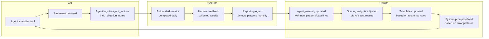

# Evaluation Framework — Big Money Realty Agentic AI System

> A comprehensive framework for measuring agent performance, detecting failures, and systematically improving agent behavior over time. Evaluation is not an afterthought — it is built into the system architecture.

---

## Evaluation Philosophy

The evaluation framework is built on three principles:

1. **Ground truth comes from business outcomes, not just model outputs.** A lead score is good if qualified leads convert; a follow-up draft is good if Damian approves it and the lead responds — not just if it reads well.

2. **Human feedback is the most valuable signal.** Every time Damian accepts or rejects a draft, approves or disputes a score, or acts on a recommendation, that is a labeled data point. The system is designed to capture these signals systematically.

3. **Measure what you can automate, surface what requires judgment.** Completion rates, latency, and format correctness are automated. Quality, relevance, and business impact require human review — but should require minimal time (< 10 minutes/week).

---

## Agent Evaluation Metrics

### Lead Discovery Agent

| Metric | Definition | Target | Measurement Method |
|---|---|---|---|
| Discovery completeness | % of newly submitted leads processed within 30 min | > 95% | `submitted_at` vs. `agent_processed_at` delta, queried daily |
| Duplicate detection precision | % of flagged duplicates that are true duplicates | > 90% | Weekly spot-check: review 10 `is_duplicate=true` records |
| Duplicate detection recall | % of actual duplicates that were caught | > 85% | Quarterly audit of `leads` table for email/phone overlap |
| Normalization correctness | % of phone numbers in correct E.164 format post-normalization | > 98% | Automated regex check on `phone_normalized` field |
| Error rate | % of discovery runs with `success=false` in agent_actions | < 2% | Query `agent_actions` weekly |
| Processing latency (p95) | 95th percentile time from submission to `discovered` status | < 10 min | `agent_processed_at - submitted_at` |

### Lead Qualification Agent

| Metric | Definition | Target | Measurement Method |
|---|---|---|---|
| Human agreement rate | % of scores Damian agrees with when reviewed | > 75% | Track `lead_scores.human_agrees` weekly |
| Hot lead precision | % of "hot" leads that resulted in contact or appointment | > 60% | Join `lead_scores` (tier=hot) with `followups` (status=sent) and `appointments` |
| Hot lead recall | % of leads that converted that were originally scored "hot" | > 70% | Manual review of closed deals vs. original tier |
| Coverage rate | % of discovered leads that receive a score within 5 min | > 99% | `agent_actions` count vs. `leads` count with status=discovered |
| Score stability | Std deviation of scores for similar leads | < 10 points | Compare scores for leads with identical signal profiles |
| Reasoning quality | Damian rates reasoning as clear and accurate | >= 4/5 | Monthly batch review (5 min) |

### Follow-Up Agent

| Metric | Definition | Target | Measurement Method |
|---|---|---|---|
| Draft approval rate | % of drafts Damian approves without edit | > 80% | `followups` count: status=scheduled / (scheduled + rejected) |
| Personalization rate | % of drafts containing lead-specific data (name, address, or equity) | 100% of hot/warm | Automated content check on `followups.body` |
| Draft latency | Time from qualification to follow-up draft available | < 15 min (hot), < 2 hr (warm) | `followups.created_at - leads.agent_processed_at` |
| Response rate (hot leads) | % of sent hot follow-ups that receive a reply or call | > 25% | `followups.replied_at` not null / total sent hot |
| Response rate (warm leads) | % of sent warm follow-ups that receive a reply | > 15% | Same, filtered to warm tier |
| Over-contact rate | % of leads contacted more than 3x in 7 days | < 1% | Query `followups` by lead, count by date window |

### CRM Agent

| Metric | Definition | Target | Measurement Method |
|---|---|---|---|
| CRM completeness score (avg) | Average completeness score across all records | > 75% | Sum completeness scores / record count, from `agent_actions` audits |
| Enrichment success rate | % of attempted enrichments that added at least 1 field | > 60% | `agent_actions` where action_type=enriched, check output_payload |
| Opportunity flag acceptance | % of flagged records Damian acts on | > 50% | Compare `master_crm` flags with Damian's follow-up actions |
| Duplicate detection accuracy | % of flagged duplicate pairs confirmed by Damian | > 85% | Weekly duplicate review session |
| Audit coverage | % of CRM records audited in last 30 days | > 90% | Compare last audit_date vs. total record count |
| False positive flags | % of flagged records Damian dismisses as not opportunities | < 25% | Track dismissed vs. accepted flags |

### Reporting Agent

| Metric | Definition | Target | Measurement Method |
|---|---|---|---|
| Report completeness | % of reports with all 7 required sections populated | 100% | Automated schema validation on `reports.metrics` JSONB |
| Report delivery timeliness | % of weekly reports generated by Monday 01:00 UTC | > 99% | `reports.created_at` timestamp check |
| Recommendation acceptance | % of top-3 recommendations Damian acts on (per month) | > 40% | Damian marks acted items; track monthly |
| Anomaly precision | % of flagged anomalies confirmed as real issues | > 75% | Damian reviews anomalies weekly; logs confirmed/dismissed |
| Narrative clarity rating | Damian rates report readability | >= 4/5 | Monthly rating (takes 30 seconds) |
| Generation performance | Report generation time | < 90 seconds | `reports.generation_duration_ms` |

---

## Evaluation Methodology

### Automated Evaluation (Daily/Weekly)

These metrics are computed automatically from Supabase data, no human input required:

```sql
-- Daily: Discovery completeness
SELECT
  COUNT(*) FILTER (WHERE agent_processed_at - submitted_at < INTERVAL '30 minutes') AS within_30min,
  COUNT(*) AS total,
  ROUND(100.0 * COUNT(*) FILTER (WHERE agent_processed_at - submitted_at < INTERVAL '30 minutes') / COUNT(*), 1) AS pct
FROM leads
WHERE submitted_at > NOW() - INTERVAL '7 days'
  AND processed = true;

-- Weekly: Qualification coverage
SELECT
  l.status,
  COUNT(*) AS count
FROM leads l
WHERE l.created_at > NOW() - INTERVAL '7 days'
GROUP BY l.status;

-- Weekly: Follow-up approval rate
SELECT
  COUNT(*) FILTER (WHERE status = 'scheduled') AS approved,
  COUNT(*) FILTER (WHERE status = 'rejected') AS rejected,
  COUNT(*) FILTER (WHERE status = 'expired') AS expired,
  ROUND(100.0 * COUNT(*) FILTER (WHERE status = 'scheduled') / NULLIF(COUNT(*), 0), 1) AS approval_pct
FROM followups
WHERE created_at > NOW() - INTERVAL '7 days';
```

### Human-in-the-Loop Evaluation (Weekly, ~10 min)

The following require Damian's input and are collected through the dashboard:

1. **Lead score review** — Damian sees 5–10 recently scored leads, rates each `agree / disagree / unsure`. Takes < 3 minutes.

2. **Draft quality review** — When approving/rejecting drafts, Damian optionally rates quality 1–5. Dashboard prompts this.

3. **Opportunity flag review** — CRM Agent flags are shown in a dedicated section. Damian dismisses or acts. Takes < 2 minutes.

4. **Report review** — Weekly report section includes "Did you act on these recommendations?" with checkboxes. Takes < 1 minute.

---

## A/B Testing Framework

### Testing Qualification Scoring Weights

Different scoring rubrics can be tested by running parallel scoring variants:

```typescript
// agent_memory key: "scoring_variant"
{
  "variant_a": {
    "seller_type_points": 20,
    "buyer_type_points": 15,
    "high_equity_points": 15,
    "distressed_points": 10
  },
  "variant_b": {
    "seller_type_points": 25,    // Test: weight seller intent higher
    "buyer_type_points": 10,
    "high_equity_points": 20,    // Test: weight equity higher
    "distressed_points": 8
  }
}
```

Assign 50% of leads to each variant. After 30 days, compare:
- `human_agrees` rate by variant
- Appointment set rate by variant
- Closed deal rate by variant

### Testing Follow-Up Message Templates

```sql
-- Track performance by template variant
SELECT
  f.template_key,
  COUNT(*) AS total_sent,
  COUNT(*) FILTER (WHERE f.replied_at IS NOT NULL) AS replies,
  ROUND(100.0 * COUNT(*) FILTER (WHERE f.replied_at IS NOT NULL) / COUNT(*), 1) AS response_rate
FROM followups f
WHERE f.status = 'sent'
  AND f.template_key IS NOT NULL
GROUP BY f.template_key
ORDER BY response_rate DESC;
```

Templates with response rate below 15% are retired. Templates above 30% are promoted to `agent_memory` as the default.

---

## Reflection Loop Design

The system is designed for continuous improvement through structured reflection.



### Monthly Reflection Cycle

1. **Week 1–4:** Agents run, collecting data in `agent_actions` and user feedback in `followups`, `lead_scores`
2. **Monday:** Reporting Agent generates weekly report, updates baselines in `agent_memory`
3. **Month end:** Reporting Agent runs monthly analysis:
   - Compare A/B test variants
   - Identify top/bottom performing templates
   - Flag systematic qualification errors (leads scored hot that went cold)
   - Update `agent_memory` with improved weights and templates
4. **Manual review (30 min):** Damian reviews monthly report, makes any system prompt adjustments

---

## Failure Mode Analysis

### Lead Discovery Agent

| Failure Mode | Probability | Impact | Detection | Mitigation |
|---|---|---|---|---|
| Supabase connection timeout | Low | Medium | `agent_actions.success=false` | Retry with backoff; alert after 3 failures |
| Duplicate not detected (false negative) | Medium | Low | Weekly spot-check audit | Improve similarity matching; check normalized phone |
| Wrong lead type classified from message | Medium | Low | Human score disagreement | Improve intent detection in normalization step |
| Cron job fails silently | Low | High | Monitor `agent_actions` count daily | Alert if no discovery run in > 60 min during business hours |

### Lead Qualification Agent

| Failure Mode | Probability | Impact | Detection | Mitigation |
|---|---|---|---|---|
| CRM join misses valid match | Medium | Medium | Low CRM linkage rate in metrics | Improve matching logic; fuzzy name match |
| Systematically underscore a lead type | Low | High | Low conversion rate for that tier | A/B test scoring weights; monthly calibration |
| Claude returns malformed tool call | Low | Medium | Parse error in tool executor | Strict input schema validation; fallback score |
| Score drift over time | Low | High | Reporting Agent anomaly detection | Monthly recalibration of weights |

### Follow-Up Agent

| Failure Mode | Probability | Impact | Detection | Mitigation |
|---|---|---|---|---|
| Draft contains incorrect property data | Low | High | Damian rejects and notes error | Cross-check CRM data before inserting into template |
| Over-personalization creeps uncanny | Medium | Medium | Low approval rate | Human rating on drafts; simplify templates |
| SMS exceeds 160 chars | Medium | Low | Automated length check | Hard limit enforced in `draft_sms` tool |
| Lead contacted after opting out | Very Low | Very High | Manual tracking for now | Phase 3: Add opt-out table, check before drafting |

### CRM Agent

| Failure Mode | Probability | Impact | Detection | Mitigation |
|---|---|---|---|---|
| Enriches wrong CRM record | Low | High | Damian notices incorrect data | Require confidence threshold > 0.9 for auto-enrich |
| Flags non-opportunities excessively | Medium | Medium | Low acceptance rate metric | Tighten flag criteria; require 2+ signals to flag |
| Duplicate merge causes data loss | Low | Very High | Manual audit before merge | Never auto-merge; always require human approval |

### Reporting Agent

| Failure Mode | Probability | Impact | Detection | Mitigation |
|---|---|---|---|---|
| Report omits a required section | Low | Medium | Schema validation check | Assert all 7 sections present before writing |
| Anomaly detection false positive | Medium | Low | Low confirmed-anomaly rate | Require > 2 standard deviations for flag |
| Baseline becomes stale | Medium | Medium | Anomaly rate goes to zero | Force baseline recalculation monthly |
| Claude generates hallucinated market data | Very Low | High | Damian spots unfamiliar numbers | Compute all numbers from Supabase, not from Claude |

---

## Human-in-the-Loop Checkpoints

| Checkpoint | Trigger | Time Required | Location in System |
|---|---|---|---|
| Follow-up draft approval | Every draft (hot/warm) | 30–60 sec/draft | `/dashboard` drafts section |
| Lead score agreement | Weekly batch (5–10 samples) | 3–5 min | `/dashboard` scores tab |
| Opportunity flag review | Weekly, when flags exist | 2–3 min | `/dashboard` CRM tab |
| Duplicate pair review | Weekly, when duplicates found | 2–3 min | `/dashboard` CRM tab |
| Anomaly review | Weekly, in Reporting section | 1–2 min | `/dashboard` reports tab |
| Monthly system review | Monthly | 30 min | Dashboard + docs review |

**Total weekly time investment for Damian: ~10 minutes**

This is the explicit tradeoff: agents handle 95% of the work autonomously; Damian provides 10 minutes of high-quality human judgment weekly to keep the system calibrated.

---

## Dashboard KPIs

The following KPIs should be visible on the primary dashboard view:

### Lead Pipeline Health

| KPI | Calculation | Update Frequency |
|---|---|---|
| New leads (7 days) | `COUNT(*) FROM leads WHERE submitted_at > 7 days ago` | Realtime |
| Hot leads pending contact | `COUNT FROM lead_scores WHERE tier=hot AND status=qualified` | Hourly |
| Drafts awaiting approval | `COUNT FROM followups WHERE status=draft` | Realtime |
| Response rate (30 days) | `replied/sent FROM followups WHERE sent_at > 30 days ago` | Daily |

### Agent System Health

| KPI | Calculation | Update Frequency |
|---|---|---|
| Agent error rate (24h) | `COUNT(success=false) / COUNT(*) FROM agent_actions` | Hourly |
| Avg discovery latency | `AVG(agent_processed_at - submitted_at)` | Daily |
| Last report generated | `MAX(created_at) FROM reports` | On report generation |
| CRM completeness (avg) | Rolling average from audit logs | Weekly |

### Business Performance

| KPI | Calculation | Update Frequency |
|---|---|---|
| Total equity in pipeline | `SUM(estimated_equity) FROM master_crm WHERE lead_status != 'dead'` | Daily |
| Distressed properties | `COUNT(*) FROM master_crm WHERE is_distressed = true` | Daily |
| Appointments set (30 days) | `COUNT FROM appointments WHERE created_at > 30 days ago` | Realtime |
| Leads by type (pie) | `GROUP BY type FROM leads WHERE submitted_at > 30 days ago` | Daily |
