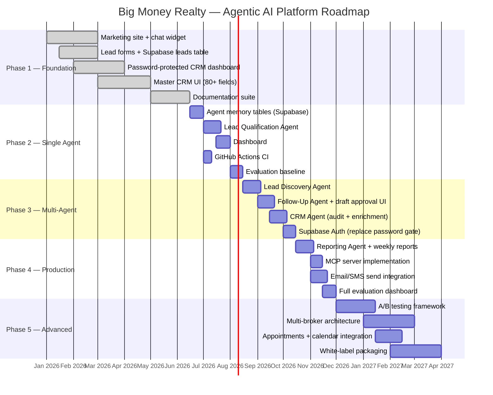

# Implementation Roadmap — Big Money Realty Agentic AI Platform

> A prioritized 5-phase implementation plan with deliverables, success criteria, effort estimates, and GitHub milestone recommendations.

---

## Roadmap Overview



---

## Phase 1: Proof of Concept (COMPLETE)

**Objective:** Establish the production foundation — live marketing site, AI chat widget, lead capture, and CRM dashboard.

### Goals

- Deploy a production-quality marketing site for Big Money Realty
- Integrate Claude Haiku as a conversational lead qualification assistant
- Capture all lead types into Supabase with a clean data model
- Build a password-protected CRM dashboard with property intelligence
- Document the architecture for the agent phases to follow

### Deliverables

| Deliverable | Status | Location |
|---|---|---|
| Marketing site (homepage, buy, sell, about, listings) | COMPLETE | `app/page.tsx`, `app/buy/`, `app/sell/`, `app/about/`, `app/listings/` |
| AI chat widget (Claude Haiku) | COMPLETE | `components/AIChatWidget.tsx`, `app/api/chat/route.ts` |
| Lead capture forms (4 types) | COMPLETE | `components/LeadForm.tsx`, `app/api/leads/route.ts` |
| CRM dashboard — web leads view | COMPLETE | `app/dashboard/page.tsx` |
| CRM dashboard — property intelligence view | COMPLETE | `app/dashboard/page.tsx` (CRMView component) |
| CMA detail panel (80+ fields) | COMPLETE | `app/dashboard/page.tsx` (CMAPanel component) |
| n8n webhook integration | COMPLETE | `components/LeadForm.tsx` |
| Debug API endpoint | COMPLETE | `app/api/debug/route.ts` |
| Full documentation suite | COMPLETE | All `.md` files in repo root |

### Success Criteria

- [x] Site deploys to production on Vercel without errors
- [x] Chat widget responds to queries within 3 seconds
- [x] Lead form submissions stored in Supabase `Master` table
- [x] Dashboard loads CRM data with 80+ fields displayed correctly
- [x] `npx tsc --noEmit` passes with no errors
- [x] Documentation covers all 10 GH-600 competencies

### Estimated Effort: 6–8 weeks (retrospective)

### GitHub Milestone: `v1.0 — Foundation`

---

## Phase 2: Single-Agent System

**Objective:** Implement the Lead Qualification Agent as the highest-ROI first agent. Establish the memory table infrastructure. Set up CI and the evaluation baseline.

### Goals

- Create all 8 agent memory tables in Supabase
- Implement the Lead Qualification Agent (`/api/agents/qualify`)
- Add scoring UI to the dashboard (view scores, agree/disagree)
- Set up GitHub Actions for continuous type checking and linting
- Measure the evaluation baseline for the first 30 days

### Deliverables

| Deliverable | Priority | Est. Effort |
|---|---|---|
| Create Supabase agent tables (via migration scripts) | P0 | 1 day |
| `lib/agents/qualify.ts` — Qualification Agent core logic | P0 | 3 days |
| `app/api/agents/qualify/route.ts` — API endpoint | P0 | 1 day |
| Tool implementations: `score_lead`, `classify_lead_tier`, `write_lead_score` | P0 | 2 days |
| Dashboard: lead scoring tab (view score, tier, reasoning) | P1 | 2 days |
| Dashboard: score agreement UI (agree/disagree/unsure) | P1 | 1 day |
| `.github/workflows/ci.yml` — lint + typecheck on PR | P1 | 0.5 days |
| Manual trigger endpoint (`POST /api/agents/qualify`) | P1 | 0.5 days |
| Evaluation baseline: 30-day metric collection | P2 | Ongoing |

### Technical Notes

```typescript
// Phase 2 target implementation pattern
// app/api/agents/qualify/route.ts

export async function POST(req: NextRequest) {
  const { lead_id } = await req.json();
  if (!lead_id) return NextResponse.json({ error: "lead_id required" }, { status: 400 });

  const supabase = getSupabaseServiceRole();

  // Fetch lead with CRM join
  const lead = await fetchLeadWithCRM(supabase, lead_id);
  if (!lead) return NextResponse.json({ error: "Lead not found" }, { status: 404 });

  // Run qualification agent
  const result = await runQualificationAgent({
    lead,
    supabase,
    model: "claude-haiku-4-5-20251001",  // Phase 2: Haiku for cost
  });

  return NextResponse.json(result);
}
```

### Success Criteria

- [ ] All 8 Supabase tables created and migrated without data loss
- [ ] Qualification Agent scores 100 test leads with > 75% Damian agreement
- [ ] Scores persisted to `lead_scores` table with reasoning
- [ ] Dashboard shows scores and accepts human feedback
- [ ] GitHub Actions CI passes on all PRs
- [ ] `agent_actions` table accumulating agent run logs

### Estimated Effort: 3–4 weeks

### GitHub Milestone: `v2.0 — Qualification Agent`

---

## Phase 3: Multi-Agent System

**Objective:** Add the Lead Discovery, Follow-Up, and CRM agents. Implement the human approval workflow for follow-up drafts. Upgrade authentication.

### Goals

- Implement automated lead discovery on a 30-minute cron schedule
- Implement the Follow-Up Agent with draft generation and approval UI
- Implement the CRM Agent for data quality and enrichment
- Replace the password-gate with proper Supabase Auth
- Wire the three-agent pipeline (Discovery → Qualification → Follow-Up + CRM)

### Deliverables

| Deliverable | Priority | Est. Effort |
|---|---|---|
| `lib/agents/discover.ts` + `/api/agents/discover/route.ts` | P0 | 3 days |
| Vercel cron job: run discovery every 30 minutes | P0 | 0.5 days |
| `lib/agents/followup.ts` + `/api/agents/followup/route.ts` | P0 | 4 days |
| Tool: `draft_email`, `draft_sms`, `schedule_followup` | P0 | 2 days |
| Dashboard: follow-up drafts approval UI | P0 | 3 days |
| `lib/agents/crm.ts` + `/api/agents/crm/route.ts` | P1 | 3 days |
| Tool: `audit_crm_record`, `enrich_crm_from_lead`, `flag_high_opportunity` | P1 | 2 days |
| Dashboard: CRM flags and opportunity review panel | P1 | 2 days |
| Supabase Auth migration (replace password header) | P1 | 2 days |
| Agent pipeline orchestration (Discovery triggers Qualification) | P1 | 2 days |

### Architecture Change: Cron Job Pattern

```typescript
// vercel.json — cron configuration
{
  "crons": [
    {
      "path": "/api/agents/discover",
      "schedule": "*/30 * * * *"
    },
    {
      "path": "/api/agents/crm/audit",
      "schedule": "0 2 * * *"
    }
  ]
}
```

### Success Criteria

- [ ] Discovery Agent runs every 30 minutes and processes all new leads
- [ ] Follow-up drafts generated within 15 minutes for hot leads
- [ ] Damian can approve/reject drafts from dashboard in < 30 seconds each
- [ ] CRM Agent nightly audit flags high-opportunity records
- [ ] Authentication migrated to Supabase Auth
- [ ] Pipeline end-to-end latency: form submission → draft ready < 45 minutes

### Estimated Effort: 5–7 weeks

### GitHub Milestone: `v3.0 — Multi-Agent Pipeline`

---

## Phase 4: Production Deployment

**Objective:** Complete the five-agent system with the Reporting Agent. Implement the MCP server. Connect to real email/SMS delivery. Build the full evaluation dashboard.

### Goals

- Implement the Reporting Agent with weekly automated reports
- Build and deploy the MCP server for standardized data access
- Integrate an email provider (Resend or Postmark) and SMS provider (Twilio)
- Build the full evaluation dashboard with all KPIs
- Validate the system against the evaluation framework targets

### Deliverables

| Deliverable | Priority | Est. Effort |
|---|---|---|
| `lib/agents/reporting.ts` + `/api/agents/reporting/route.ts` | P0 | 3 days |
| Monday 00:00 UTC cron for weekly reports | P0 | 0.5 days |
| Dashboard: reports view with narrative and metrics | P0 | 2 days |
| Email integration: Resend or Postmark for `followups` send | P0 | 2 days |
| SMS integration: Twilio for `followups` SMS send | P1 | 1.5 days |
| MCP server: `bigmoneyrealty-mcp` | P1 | 3 days |
| MCP resources: `leads://active`, `crm://properties`, `reports://weekly-latest` | P1 | 2 days |
| Evaluation dashboard: all KPI panels | P1 | 3 days |
| A/B test infrastructure: scoring variant routing | P2 | 2 days |
| Opt-out tracking table and compliance check | P0 | 1 day |

### Email/SMS Provider Integration

```typescript
// lib/email.ts — Resend integration
import { Resend } from "resend";

export async function sendFollowUp(followup: Followup, lead: Lead): Promise<void> {
  const resend = new Resend(process.env.RESEND_API_KEY!);
  await resend.emails.send({
    from: "Damian Einbinder <damian@bigmoneyrealty.com>",
    to: lead.email,
    subject: followup.subject ?? "Following up — Big Money Realty",
    text: followup.body,
  });
}
```

### Success Criteria

- [ ] Weekly reports generated every Monday without manual trigger
- [ ] Reports contain all 7 required sections with accurate data
- [ ] Email and SMS sends working end-to-end with Resend + Twilio
- [ ] MCP server responds to all resource and tool requests
- [ ] Evaluation dashboard shows all KPIs with correct calculations
- [ ] All five agents running in production simultaneously

### Estimated Effort: 5–6 weeks

### GitHub Milestone: `v4.0 — Full Production System`

---

## Phase 5: Advanced Agentic Platform

**Objective:** Evolve the system from a single-broker tool into a reusable platform. Implement advanced features, multi-broker architecture, and white-label packaging.

### Goals

- Implement full A/B testing framework for scoring and messaging
- Migrate to multi-broker architecture with RLS-based tenant isolation
- Add appointments and calendar integration
- Package as a white-label product deployable for other brokers
- Publish MCP server to a registry for external integration

### Deliverables

| Deliverable | Priority | Est. Effort |
|---|---|---|
| A/B testing: variant routing and statistical significance tracking | P1 | 5 days |
| Multi-broker: add `broker_id` to all tables, update RLS policies | P1 | 4 days |
| Multi-broker: broker onboarding flow | P1 | 3 days |
| Appointments table + calendar integration (Calendly or Google Calendar) | P2 | 4 days |
| Dashboard: appointments view and management | P2 | 2 days |
| White-label: configurable branding (broker name, colors, logo) | P2 | 3 days |
| White-label: deployment documentation for new brokers | P2 | 2 days |
| MCP server registry publication | P3 | 2 days |
| Advanced evaluation: cohort analysis, attribution modeling | P3 | 5 days |

### Multi-Broker Architecture Pattern

```sql
-- Add broker_id to all agent tables
ALTER TABLE leads ADD COLUMN broker_id UUID NOT NULL REFERENCES users(id);
ALTER TABLE lead_scores ADD COLUMN broker_id UUID NOT NULL;
ALTER TABLE followups ADD COLUMN broker_id UUID NOT NULL;
-- ... all tables

-- Update RLS policies to be broker-scoped
CREATE POLICY "leads_broker_isolation" ON leads
  FOR ALL USING (broker_id = auth.uid());
```

### Success Criteria

- [ ] A/B test framework shows statistically significant results after 90 days
- [ ] Second broker successfully onboarded on same infrastructure
- [ ] Data isolation verified: broker A cannot see broker B's leads
- [ ] White-label deployment completes in < 4 hours for new broker
- [ ] Appointments sync bidirectionally with at least one calendar system

### Estimated Effort: 10–14 weeks

### GitHub Milestone: `v5.0 — Multi-Broker Platform`

---

## GitHub Milestone Summary

| Milestone | Version | Target | Key Acceptance Criteria |
|---|---|---|---|
| v1.0 — Foundation | `v1.0` | Complete | Site live, chat working, leads captured, dashboard functional |
| v2.0 — Qualification Agent | `v2.0` | Q3 2026 | Leads scored automatically, > 75% human agreement, CI passing |
| v3.0 — Multi-Agent Pipeline | `v3.0` | Q4 2026 | 5-agent pipeline running, draft approval UI live, auth upgraded |
| v4.0 — Full Production System | `v4.0` | Q1 2027 | All agents running, email/SMS sending, weekly reports generating |
| v5.0 — Multi-Broker Platform | `v5.0` | Q2 2027 | Multi-tenant, white-label, A/B testing, appointments integrated |

---

## Prioritization Rationale

Phases are ordered by ROI, not technical complexity:

1. **Phase 2 first (Qualification)** because scoring is the highest-value single agent — it directly tells Damian where to focus. It also has no external dependencies (no email/SMS, no cron).

2. **Phase 3 second (Discovery + Follow-Up + CRM)** because follow-up automation directly generates revenue. The CRM Agent piggybacks on the same pipeline.

3. **Phase 4 (Reporting + MCP + Send)** closes the loop — Damian gets insights, and communications actually send.

4. **Phase 5 (Platform)** is a business scaling decision, not an operational necessity. It depends on Phase 4 proving the model works.

---

## Risk Register

| Risk | Likelihood | Impact | Mitigation |
|---|---|---|---|
| Anthropic API rate limits at scale | Low | Medium | Implement request queuing; use Haiku for bulk tasks |
| Supabase free tier limits hit | Medium | Low | Monitor usage; upgrade to Pro ($25/mo) at first limit |
| Claude model version deprecation | Medium | Medium | Pin model versions; test new versions before switching |
| Email deliverability issues | Medium | High | Use reputable provider (Resend/Postmark); warm up sending domain |
| Scope creep in Phase 3 | High | Medium | Hard milestone dates; no new features until milestone closes |
| Dashboard UX complexity | Medium | Low | Minimize — only show what Damian uses weekly |
