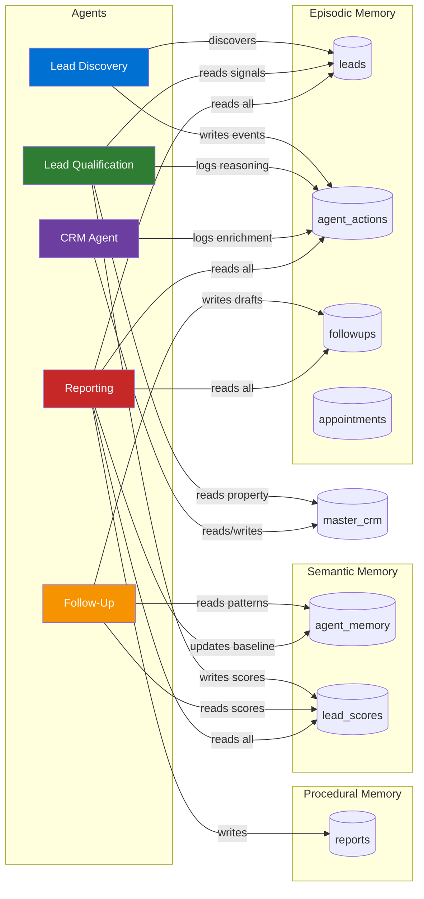

# Supabase Memory Architecture — Big Money Realty

> This document defines the complete persistent memory layer for the Big Money Realty agentic AI system. All agent state, lead history, and communication records are stored in Supabase (PostgreSQL).

---

## Memory Architecture Overview

Cognitive science distinguishes three types of long-term memory. This architecture maps each type to specific Supabase tables:

| Memory Type | Description | Tables |
|---|---|---|
| **Episodic** | Records of specific events — what happened, when, to whom | `leads`, `agent_actions`, `followups`, `appointments` |
| **Semantic** | General knowledge and patterns extracted from events | `agent_memory` (type=knowledge), `lead_scores` |
| **Procedural** | How to do things — workflows and templates that work | `agent_memory` (type=procedure), `reports` |
| **Working** | Active context during a single agent run | In-memory (API call lifetime only) |

---

## Memory Flow Diagram



---

## Table Schemas

### 1. `users` — System Users and Dashboard Access

```sql
CREATE TABLE users (
    id UUID PRIMARY KEY DEFAULT gen_random_uuid(),
    email TEXT NOT NULL UNIQUE,
    role TEXT NOT NULL DEFAULT 'broker'
        CHECK (role IN ('admin', 'broker', 'agent', 'viewer')),
    display_name TEXT,
    broker_id UUID,                    -- For future multi-broker support
    is_active BOOLEAN NOT NULL DEFAULT true,
    last_login_at TIMESTAMPTZ,
    created_at TIMESTAMPTZ NOT NULL DEFAULT NOW(),
    updated_at TIMESTAMPTZ NOT NULL DEFAULT NOW()
);

-- Indexes
CREATE INDEX idx_users_email ON users(email);
CREATE INDEX idx_users_broker_id ON users(broker_id);

-- RLS
ALTER TABLE users ENABLE ROW LEVEL SECURITY;

CREATE POLICY "users_service_role_full_access" ON users
    FOR ALL USING (auth.role() = 'service_role');

CREATE POLICY "users_view_own_record" ON users
    FOR SELECT USING (auth.uid() = id);
```

---

### 2. `leads` — Normalized Lead Records (Episodic)

Replaces/extends the current `Master` table. All web leads flow into this table after Discovery Agent normalization.

```sql
CREATE TABLE leads (
    id UUID PRIMARY KEY DEFAULT gen_random_uuid(),

    -- Identity
    name TEXT NOT NULL,
    email TEXT NOT NULL,
    phone TEXT,
    phone_normalized TEXT,             -- E.164 format: +17025551234

    -- Lead classification
    type TEXT NOT NULL DEFAULT 'general'
        CHECK (type IN ('buyer', 'seller', 'valuation', 'investor', 'general')),
    status TEXT NOT NULL DEFAULT 'new'
        CHECK (status IN ('new', 'discovered', 'qualified', 'contacted', 'nurture', 'appointment_set', 'closed', 'dead')),
    source TEXT DEFAULT 'bigmoneyrealty.com',

    -- Content
    message TEXT,

    -- CRM linkage
    crm_record_id BIGINT,              -- FK to master_crm if address match found

    -- Agent processing flags
    processed BOOLEAN NOT NULL DEFAULT false,
    agent_reviewed BOOLEAN NOT NULL DEFAULT false,
    is_duplicate BOOLEAN NOT NULL DEFAULT false,
    duplicate_of UUID REFERENCES leads(id),

    -- Metadata
    submitted_at TIMESTAMPTZ NOT NULL DEFAULT NOW(),
    agent_processed_at TIMESTAMPTZ,
    created_at TIMESTAMPTZ NOT NULL DEFAULT NOW(),
    updated_at TIMESTAMPTZ NOT NULL DEFAULT NOW()
);

-- Indexes
CREATE INDEX idx_leads_status ON leads(status);
CREATE INDEX idx_leads_processed ON leads(processed) WHERE processed = false;
CREATE INDEX idx_leads_type ON leads(type);
CREATE INDEX idx_leads_email ON leads(email);
CREATE INDEX idx_leads_submitted_at ON leads(submitted_at DESC);
CREATE INDEX idx_leads_crm_record ON leads(crm_record_id);

-- RLS
ALTER TABLE leads ENABLE ROW LEVEL SECURITY;

CREATE POLICY "leads_service_role_full_access" ON leads
    FOR ALL USING (auth.role() = 'service_role');

-- Public insert (web form submissions)
CREATE POLICY "leads_anon_insert" ON leads
    FOR INSERT WITH CHECK (true);
```

---

### 3. `agent_actions` — Agent Activity Log (Episodic)

Every action taken by every agent is written here. This table is the audit trail, the debugging tool, and the training data for evaluation.

```sql
CREATE TABLE agent_actions (
    id UUID PRIMARY KEY DEFAULT gen_random_uuid(),

    -- Which agent
    agent_name TEXT NOT NULL
        CHECK (agent_name IN ('lead_discovery', 'lead_qualification', 'follow_up', 'crm', 'reporting')),

    -- What it did
    action_type TEXT NOT NULL,
    -- Examples by agent:
    -- lead_discovery: discovered, normalized, deduplicated, skipped, error
    -- lead_qualification: scored, classified, skipped_insufficient_data, error
    -- follow_up: drafted_email, drafted_sms, scheduled, sent, failed
    -- crm: audited, enriched, flagged_opportunity, deduplicated, error
    -- reporting: aggregated, wrote_report, detected_anomaly, error

    -- Context
    lead_id UUID REFERENCES leads(id),
    crm_record_id BIGINT,
    followup_id UUID,                  -- References followups.id
    report_id UUID,                    -- References reports.id

    -- Inputs and outputs
    input_payload JSONB,               -- What the agent received
    output_payload JSONB,              -- What the agent produced
    tool_calls JSONB,                  -- Array of { tool_name, input, output } objects

    -- Result
    result_summary TEXT NOT NULL,      -- Human-readable description of what happened
    success BOOLEAN NOT NULL DEFAULT true,
    error_message TEXT,

    -- Reflection
    reflection_notes TEXT,             -- Agent's self-assessment of this action
    confidence_score DECIMAL(3,2),     -- 0.00–1.00

    -- Performance
    duration_ms INTEGER,               -- How long the agent took
    tokens_used INTEGER,               -- Claude tokens consumed
    model_used TEXT,                   -- Which Claude model

    -- Timing
    created_at TIMESTAMPTZ NOT NULL DEFAULT NOW()
);

-- Indexes
CREATE INDEX idx_agent_actions_agent ON agent_actions(agent_name);
CREATE INDEX idx_agent_actions_lead ON agent_actions(lead_id);
CREATE INDEX idx_agent_actions_type ON agent_actions(action_type);
CREATE INDEX idx_agent_actions_created ON agent_actions(created_at DESC);
CREATE INDEX idx_agent_actions_success ON agent_actions(success);

-- RLS
ALTER TABLE agent_actions ENABLE ROW LEVEL SECURITY;

CREATE POLICY "agent_actions_service_role_full_access" ON agent_actions
    FOR ALL USING (auth.role() = 'service_role');
```

---

### 4. `agent_memory` — Cross-Session Knowledge Store (Semantic + Procedural)

Long-term memory that persists across agent runs. Agents read from here to apply learned patterns; the Reporting Agent writes to here after detecting trends.

```sql
CREATE TABLE agent_memory (
    id UUID PRIMARY KEY DEFAULT gen_random_uuid(),

    -- Scope
    agent_name TEXT NOT NULL
        CHECK (agent_name IN ('lead_discovery', 'lead_qualification', 'follow_up', 'crm', 'reporting', 'system')),

    memory_type TEXT NOT NULL
        CHECK (memory_type IN ('knowledge', 'procedure', 'baseline', 'preference', 'anomaly_pattern')),

    -- Content
    key TEXT NOT NULL,                 -- Lookup key (e.g., "hot_lead_signals", "email_template_v2")
    value JSONB NOT NULL,              -- The stored knowledge or template
    description TEXT,                  -- Human-readable description of what this memory contains

    -- Confidence and validity
    confidence DECIMAL(3,2) DEFAULT 0.80,
    is_active BOOLEAN NOT NULL DEFAULT true,
    valid_until TIMESTAMPTZ,           -- Optional expiry for time-sensitive knowledge

    -- Provenance
    derived_from TEXT,                 -- How this was learned (e.g., "reporting_agent_weekly_analysis")
    sample_size INTEGER,               -- How many data points support this

    created_at TIMESTAMPTZ NOT NULL DEFAULT NOW(),
    updated_at TIMESTAMPTZ NOT NULL DEFAULT NOW()
);

-- Unique key per agent
CREATE UNIQUE INDEX idx_agent_memory_agent_key ON agent_memory(agent_name, key) WHERE is_active = true;

-- Indexes
CREATE INDEX idx_agent_memory_agent ON agent_memory(agent_name);
CREATE INDEX idx_agent_memory_type ON agent_memory(memory_type);
CREATE INDEX idx_agent_memory_active ON agent_memory(is_active);

-- RLS
ALTER TABLE agent_memory ENABLE ROW LEVEL SECURITY;

CREATE POLICY "agent_memory_service_role_full_access" ON agent_memory
    FOR ALL USING (auth.role() = 'service_role');
```

**Example Memory Records:**

```json
// Stored by Reporting Agent after 30 days of scoring data
{
  "agent_name": "lead_qualification",
  "memory_type": "knowledge",
  "key": "hot_lead_conversion_signals",
  "value": {
    "top_signals": ["has_phone", "seller_type", "high_equity", "distressed"],
    "avg_score_of_converted_leads": 74.2,
    "conversion_rate_by_tier": {
      "hot": 0.31,
      "warm": 0.12,
      "nurture": 0.03
    }
  },
  "confidence": 0.85,
  "sample_size": 47
}

// Stored by Follow-Up Agent after tracking message performance
{
  "agent_name": "follow_up",
  "memory_type": "procedure",
  "key": "high_equity_seller_email_template",
  "value": {
    "subject_pattern": "Quick question about [address]",
    "opening": "Hi [name], I noticed your property at [address] has significant equity...",
    "response_rate": 0.34,
    "approved_by_damian": true
  },
  "confidence": 0.78,
  "sample_size": 18
}
```

---

### 5. `lead_scores` — Qualification History (Episodic + Semantic)

```sql
CREATE TABLE lead_scores (
    id UUID PRIMARY KEY DEFAULT gen_random_uuid(),

    lead_id UUID NOT NULL REFERENCES leads(id) ON DELETE CASCADE,

    -- Score
    score INTEGER NOT NULL CHECK (score BETWEEN 0 AND 100),
    tier TEXT NOT NULL CHECK (tier IN ('hot', 'warm', 'nurture', 'cold')),

    -- Signals used
    signals_evaluated JSONB NOT NULL,
    -- Example: { "has_phone": true, "lead_type": "seller", "estimated_equity": 145000, ... }

    signal_contributions JSONB,
    -- Example: { "seller_type": 20, "has_phone": 15, "high_equity": 15, ... }

    -- Reasoning
    reasoning TEXT NOT NULL,
    recommended_action TEXT NOT NULL,

    -- Model info
    model_used TEXT,
    confidence DECIMAL(3,2),

    -- Evaluation
    human_agrees BOOLEAN,              -- Damian's assessment (null = not reviewed)
    human_notes TEXT,
    human_reviewed_at TIMESTAMPTZ,

    created_at TIMESTAMPTZ NOT NULL DEFAULT NOW()
);

-- One score per lead (upsert on re-scoring)
CREATE UNIQUE INDEX idx_lead_scores_lead_id ON lead_scores(lead_id);

-- Indexes
CREATE INDEX idx_lead_scores_tier ON lead_scores(tier);
CREATE INDEX idx_lead_scores_score ON lead_scores(score DESC);
CREATE INDEX idx_lead_scores_created ON lead_scores(created_at DESC);

-- RLS
ALTER TABLE lead_scores ENABLE ROW LEVEL SECURITY;

CREATE POLICY "lead_scores_service_role_full_access" ON lead_scores
    FOR ALL USING (auth.role() = 'service_role');
```

---

### 6. `followups` — Communication Records (Episodic)

```sql
CREATE TABLE followups (
    id UUID PRIMARY KEY DEFAULT gen_random_uuid(),

    lead_id UUID NOT NULL REFERENCES leads(id) ON DELETE CASCADE,

    -- Communication
    channel TEXT NOT NULL CHECK (channel IN ('email', 'sms', 'call_scheduled', 'manual')),
    subject TEXT,                      -- Email subject line
    body TEXT NOT NULL,

    -- Status lifecycle: draft → scheduled → sent → replied / failed / expired
    status TEXT NOT NULL DEFAULT 'draft'
        CHECK (status IN ('draft', 'scheduled', 'sent', 'replied', 'failed', 'expired', 'rejected')),

    -- Timing
    scheduled_for TIMESTAMPTZ,
    sent_at TIMESTAMPTZ,
    replied_at TIMESTAMPTZ,

    -- Human approval
    requires_human_approval BOOLEAN NOT NULL DEFAULT true,
    approved_by UUID REFERENCES users(id),
    approved_at TIMESTAMPTZ,
    rejection_reason TEXT,

    -- Performance tracking
    opened_at TIMESTAMPTZ,
    clicked_at TIMESTAMPTZ,
    response_text TEXT,

    -- Agent metadata
    drafted_by TEXT DEFAULT 'follow_up_agent',
    model_used TEXT,
    template_key TEXT,                 -- References agent_memory.key if template was used

    created_at TIMESTAMPTZ NOT NULL DEFAULT NOW(),
    updated_at TIMESTAMPTZ NOT NULL DEFAULT NOW()
);

-- Indexes
CREATE INDEX idx_followups_lead ON followups(lead_id);
CREATE INDEX idx_followups_status ON followups(status);
CREATE INDEX idx_followups_scheduled ON followups(scheduled_for) WHERE status = 'scheduled';
CREATE INDEX idx_followups_pending_approval ON followups(requires_human_approval, status)
    WHERE requires_human_approval = true AND status = 'draft';

-- RLS
ALTER TABLE followups ENABLE ROW LEVEL SECURITY;

CREATE POLICY "followups_service_role_full_access" ON followups
    FOR ALL USING (auth.role() = 'service_role');
```

---

### 7. `appointments` — Meeting and Call Records (Episodic)

```sql
CREATE TABLE appointments (
    id UUID PRIMARY KEY DEFAULT gen_random_uuid(),

    lead_id UUID REFERENCES leads(id),
    crm_record_id BIGINT,

    -- Appointment details
    appointment_type TEXT NOT NULL
        CHECK (appointment_type IN ('buyer_consultation', 'listing_appointment', 'property_tour', 'offer_review', 'closing', 'follow_up_call')),
    title TEXT NOT NULL,
    notes TEXT,

    -- Scheduling
    scheduled_for TIMESTAMPTZ NOT NULL,
    duration_minutes INTEGER DEFAULT 60,
    location TEXT,
    is_virtual BOOLEAN DEFAULT false,
    meeting_link TEXT,

    -- Status
    status TEXT NOT NULL DEFAULT 'scheduled'
        CHECK (status IN ('scheduled', 'confirmed', 'completed', 'cancelled', 'no_show')),
    outcome TEXT,                      -- Post-appointment notes

    -- Metadata
    created_by TEXT DEFAULT 'follow_up_agent',
    confirmed_at TIMESTAMPTZ,
    cancelled_at TIMESTAMPTZ,
    cancellation_reason TEXT,

    created_at TIMESTAMPTZ NOT NULL DEFAULT NOW(),
    updated_at TIMESTAMPTZ NOT NULL DEFAULT NOW()
);

-- Indexes
CREATE INDEX idx_appointments_lead ON appointments(lead_id);
CREATE INDEX idx_appointments_scheduled ON appointments(scheduled_for);
CREATE INDEX idx_appointments_status ON appointments(status);

-- RLS
ALTER TABLE appointments ENABLE ROW LEVEL SECURITY;

CREATE POLICY "appointments_service_role_full_access" ON appointments
    FOR ALL USING (auth.role() = 'service_role');
```

---

### 8. `reports` — Agent-Generated Reports (Procedural)

```sql
CREATE TABLE reports (
    id UUID PRIMARY KEY DEFAULT gen_random_uuid(),

    -- Report classification
    report_type TEXT NOT NULL
        CHECK (report_type IN ('weekly_summary', 'lead_performance', 'market_insight', 'portfolio_snapshot', 'anomaly_alert')),

    -- Time period
    period_start DATE NOT NULL,
    period_end DATE NOT NULL,

    -- Content
    headline TEXT NOT NULL,
    narrative TEXT NOT NULL,           -- Plain-language summary for Damian
    metrics JSONB NOT NULL,            -- Structured numeric data
    recommendations JSONB,             -- Array of action items
    anomalies JSONB,                   -- Flagged unusual patterns

    -- Performance vs. prior period
    prior_period_metrics JSONB,
    percent_changes JSONB,

    -- Status
    status TEXT NOT NULL DEFAULT 'generated'
        CHECK (status IN ('generating', 'generated', 'reviewed', 'archived')),
    reviewed_by UUID REFERENCES users(id),
    reviewed_at TIMESTAMPTZ,
    review_notes TEXT,

    -- Generation metadata
    generated_by TEXT DEFAULT 'reporting_agent',
    model_used TEXT,
    generation_duration_ms INTEGER,

    created_at TIMESTAMPTZ NOT NULL DEFAULT NOW()
);

-- Indexes
CREATE INDEX idx_reports_type ON reports(report_type);
CREATE INDEX idx_reports_period ON reports(period_end DESC);
CREATE INDEX idx_reports_status ON reports(status);

-- Unique constraint: one report per type per period
CREATE UNIQUE INDEX idx_reports_type_period ON reports(report_type, period_start, period_end);

-- RLS
ALTER TABLE reports ENABLE ROW LEVEL SECURITY;

CREATE POLICY "reports_service_role_full_access" ON reports
    FOR ALL USING (auth.role() = 'service_role');
```

---

## Agent Memory Access Patterns

### Lead Discovery Agent

```typescript
// Read: Check if we've seen this email before
SELECT id, name, created_at FROM leads WHERE email = $1 LIMIT 1;

// Write: Mark lead as discovered
UPDATE leads SET processed = true, agent_processed_at = NOW(), status = 'discovered'
WHERE id = $1;

// Write: Log action
INSERT INTO agent_actions (agent_name, action_type, lead_id, result_summary)
VALUES ('lead_discovery', 'discovered', $1, $2);
```

### Lead Qualification Agent

```typescript
// Read: Fetch lead with CRM join attempt
SELECT l.*, c.*
FROM leads l
LEFT JOIN master_crm c ON (
  c.owner_name ILIKE '%' || split_part(l.name, ' ', 1) || '%'
  OR c.email = l.email
)
WHERE l.id = $1;

// Write: Persist score
INSERT INTO lead_scores (lead_id, score, tier, signals_evaluated, reasoning, recommended_action)
VALUES ($1, $2, $3, $4, $5, $6)
ON CONFLICT (lead_id) DO UPDATE SET
  score = EXCLUDED.score,
  tier = EXCLUDED.tier,
  reasoning = EXCLUDED.reasoning,
  created_at = NOW();

// Read: Load semantic memory about scoring patterns
SELECT value FROM agent_memory
WHERE agent_name = 'lead_qualification'
  AND key = 'hot_lead_conversion_signals'
  AND is_active = true
LIMIT 1;
```

### Follow-Up Agent

```typescript
// Read: Qualified leads without a scheduled follow-up
SELECT l.*, s.tier, s.recommended_action, s.reasoning
FROM leads l
JOIN lead_scores s ON s.lead_id = l.id
LEFT JOIN followups f ON f.lead_id = l.id AND f.status IN ('draft','scheduled','sent')
WHERE l.status = 'qualified'
  AND s.tier IN ('hot', 'warm')
  AND f.id IS NULL;

// Read: Successful email templates from memory
SELECT key, value FROM agent_memory
WHERE agent_name = 'follow_up'
  AND memory_type = 'procedure'
  AND is_active = true
ORDER BY (value->>'response_rate')::float DESC;

// Write: Draft follow-up
INSERT INTO followups (lead_id, channel, subject, body, scheduled_for, status)
VALUES ($1, $2, $3, $4, $5, 'draft');
```

---

## Data Retention Policy

| Table | Retention Period | Rationale |
|---|---|---|
| `leads` | Indefinite | Business records; lead status may change months later |
| `agent_actions` | 2 years rolling | Audit + evaluation data; archive after 2 years |
| `agent_memory` | Indefinite (with versioning) | Core knowledge assets |
| `lead_scores` | 1 year | Re-score if stale; archive after 1 year |
| `followups` | 3 years | Communication records required for business compliance |
| `appointments` | 3 years | Business activity records |
| `reports` | 2 years rolling | Business intelligence history |
| `master_crm` | Indefinite | Property records are the core data asset |

### Archival Strategy (Phase 3+)

```sql
-- Example: Archive agent_actions older than 2 years
INSERT INTO agent_actions_archive SELECT * FROM agent_actions
WHERE created_at < NOW() - INTERVAL '2 years';

DELETE FROM agent_actions WHERE created_at < NOW() - INTERVAL '2 years';
```

---

## Supabase Client Pattern

All agent API routes must use the lazy initialization pattern to prevent build failures:

```typescript
// lib/supabase.ts
import { createClient, SupabaseClient } from "@supabase/supabase-js";

export function getSupabase(): SupabaseClient {
  if (!process.env.SUPABASE_URL || !process.env.SUPABASE_ANON_KEY) {
    throw new Error("Supabase environment variables not configured.");
  }
  return createClient(
    process.env.SUPABASE_URL,
    process.env.SUPABASE_ANON_KEY
  );
}

// For agent routes that need elevated access:
export function getSupabaseServiceRole(): SupabaseClient {
  if (!process.env.SUPABASE_URL || !process.env.SUPABASE_SERVICE_ROLE_KEY) {
    throw new Error("Supabase service role key not configured.");
  }
  return createClient(
    process.env.SUPABASE_URL,
    process.env.SUPABASE_SERVICE_ROLE_KEY
  );
}
```

**NEVER export a module-level Supabase client.** Always call `getSupabase()` inside handler functions.
