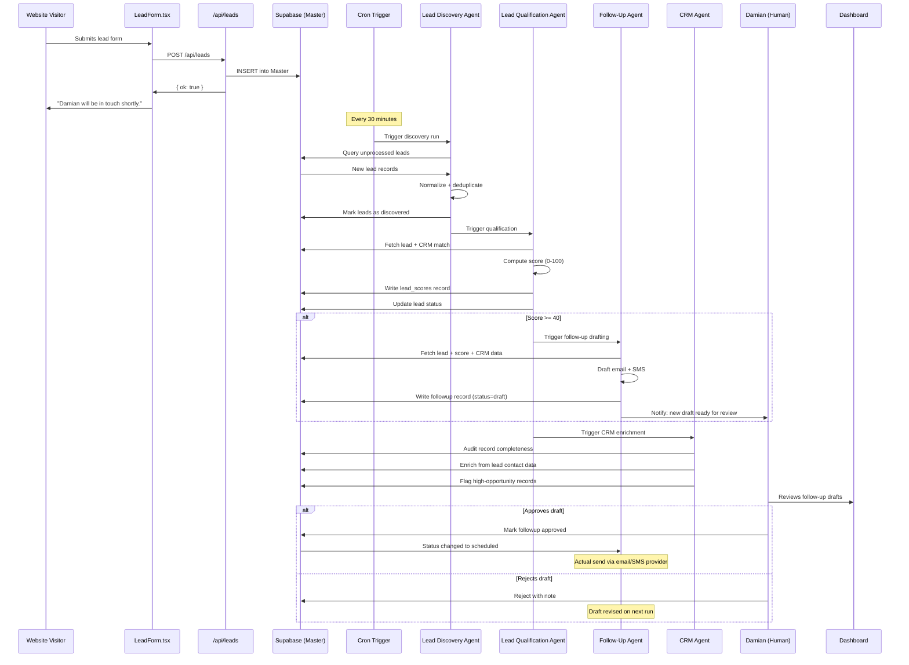
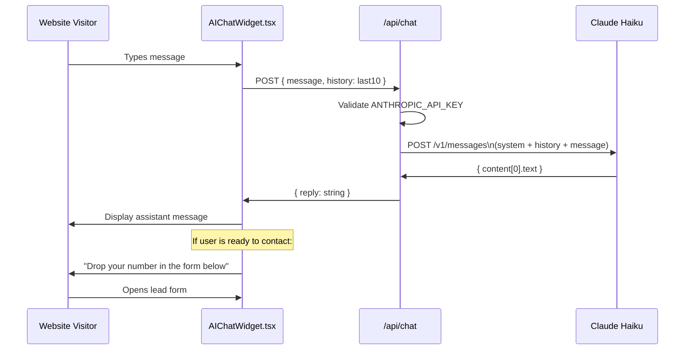

# System Design — Big Money Realty Agentic AI Platform

> Full architecture specification for the Big Money Realty agentic AI platform, including component design, data flow, API design, security model, and technology rationale.

---

## System Overview

The Big Money Realty platform is a full-stack Next.js application deployed on Vercel, integrated with Supabase as the persistent data layer and the Anthropic API as the AI inference layer. The system is designed as a phased build — the current Phase 1 foundation supports the full agent architecture without requiring a rewrite.

### Architecture Goals

1. **Operational simplicity** — one person (Damian) must be able to use this without engineering support
2. **Incremental automation** — agents are added one at a time, not all at once
3. **Human oversight preserved** — agents advise and draft; humans decide and send
4. **Production-grade from day one** — no prototypes deployed to users
5. **Cost efficiency** — use the cheapest model (Haiku) for high-volume tasks; reserve Sonnet/Opus for complex reasoning

---

## Component Diagram

```mermaid
graph TB
    subgraph "Client Layer"
        Browser[Web Browser]
        ChatWidget[AIChatWidget.tsx]
        LeadForm[LeadForm.tsx]
        Dashboard[Dashboard /dashboard]
    end

    subgraph "Next.js Application — Vercel"
        Pages[Marketing Pages\n/ /buy /sell /about /listings]
        API_Chat[/api/chat\nClaude Haiku]
        API_Leads[/api/leads\nPOST + GET]
        API_CRM[/api/crm-leads\nGET]
        API_Auth[/api/auth\nPassword validation]
        API_Debug[/api/debug\nEnv var check]
        API_Agents[/api/agents/*\nAgent endpoints - Phase 2+]
        Cron[Cron Triggers\nPhase 2+]
    end

    subgraph "AI Layer — Anthropic"
        Haiku[claude-haiku-4-5-20251001\nChat widget, high-volume tasks]
        Sonnet[claude-sonnet-4-5-20251001\nAgent reasoning - Phase 2+]
    end

    subgraph "Data Layer — Supabase"
        Master[Master table\nWeb leads]
        MasterCRM[Master CRM UI table\n80+ field property intelligence]
        AgentTables[Agent tables - Phase 2+\nleads · agent_actions ·\nagent_memory · lead_scores ·\nfollowups · appointments ·\nreports · users]
    end

    subgraph "External Integrations"
        N8N[n8n webhook\nOptional relay]
        Vercel[Vercel Edge\nDeployment + CDN]
    end

    Browser --> Pages
    Browser --> ChatWidget
    Browser --> LeadForm
    Browser --> Dashboard

    ChatWidget --> API_Chat
    LeadForm --> API_Leads
    LeadForm -.->|optional| N8N
    Dashboard --> API_Leads
    Dashboard --> API_CRM
    Dashboard --> API_Auth

    API_Chat --> Haiku
    API_Agents --> Sonnet
    Cron --> API_Agents

    API_Leads --> Master
    API_CRM --> MasterCRM
    API_Agents --> AgentTables
    API_Agents --> MasterCRM
    API_Agents --> Master
```

---

## Data Flow Diagram

### Lead Lifecycle (Full Agent Pipeline)



### Chat Widget Flow (Phase 1 — Live)



---

## API Design

### Current Endpoints (Phase 1)

#### `POST /api/leads`

Store a new lead submission.

```typescript
// Request
{
  name: string,        // required
  email: string,       // required
  phone?: string,
  message?: string,
  type: "buyer" | "seller" | "valuation" | "general",
  source?: string      // defaults to "bigmoneyrealty.com"
}

// Response 200
{ ok: true }

// Response 400
{ error: "Name and email required." }

// Response 500
{ error: "Failed to save lead." }
```

#### `GET /api/leads`

Retrieve all leads. Requires password header.

```typescript
// Request headers
{ "x-dashboard-password": string }

// Response 200
{ leads: WebLead[] }

// Response 401
{ error: "Unauthorized." }
```

#### `GET /api/crm-leads`

Retrieve CRM property intelligence. Requires password header.

```typescript
// Request headers
{ "x-dashboard-password": string }

// Response 200
{ leads: CRMLead[] }  // 80+ fields per record
```

#### `POST /api/chat`

Claude Haiku conversational endpoint.

```typescript
// Request
{
  message: string,
  history?: Array<{ role: "user" | "assistant", content: string }>
}

// Response 200
{ reply: string }

// Response 503
{ error: "AI assistant is temporarily unavailable." }
```

### Planned Agent Endpoints (Phase 2+)

#### `POST /api/agents/qualify`

Trigger the Lead Qualification Agent for a specific lead.

```typescript
// Request
{ lead_id: string }

// Response 200
{
  lead_id: string,
  score: number,
  tier: "hot" | "warm" | "nurture" | "cold",
  recommended_action: string,
  reasoning: string
}
```

#### `POST /api/agents/discover`

Trigger the Lead Discovery Agent (typically called by cron).

```typescript
// Request
{ since_hours?: number, limit?: number }

// Response 200
{
  discovered: number,
  duplicates_skipped: number,
  errors: number
}
```

#### `POST /api/agents/draft-followup`

Trigger the Follow-Up Agent for a specific lead.

```typescript
// Request
{ lead_id: string, channel: "email" | "sms" }

// Response 200
{
  followup_id: string,
  draft: { subject?: string, body: string },
  status: "draft"
}
```

---

## Security Model

### Authentication

| Resource | Method | Implementation |
|---|---|---|
| Dashboard access | Password header | `x-dashboard-password` validated server-side in API routes |
| API routes | No public auth | `/api/leads` POST is public (intentional — it's a lead form) |
| Supabase | Server-side only | `getSupabase()` called only in API routes, never in client components |
| Anthropic API | Server-side only | `ANTHROPIC_API_KEY` is a server-only env var |

### Environment Variable Handling

```typescript
// lib/supabase.ts — lazy initialization pattern
export function getSupabase() {
  return createClient(
    process.env.SUPABASE_URL!,
    process.env.SUPABASE_ANON_KEY!
  );
}
// Called INSIDE handler functions, never at module level
// This prevents Next.js build failures when env vars are absent
```

### PII Protection

| Data Type | Where Stored | Access Control |
|---|---|---|
| Lead contact info (name, email, phone) | Supabase `Master` table | Dashboard password required for read |
| Property owner info | Supabase `Master CRM UI` | Dashboard password required for read |
| Agent-drafted communications | Supabase `followups` | Dashboard password required, not publicly accessible |
| Chat conversation | Browser memory only | Not persisted to database — disappears on close |

### Row-Level Security (Planned for Phase 2)

```sql
-- All agent tables should have RLS enabled
ALTER TABLE leads ENABLE ROW LEVEL SECURITY;

-- Service role (used by agent API routes) can read/write everything
CREATE POLICY "service_role_full_access" ON leads
  FOR ALL
  USING (auth.role() = 'service_role');

-- Anon role can only insert (for lead form submissions)
CREATE POLICY "anon_insert_only" ON leads
  FOR INSERT
  WITH CHECK (true);
```

---

## Scalability Considerations

### Current Scale (Phase 1)

The platform is designed for a single-broker operation:
- 20–100 web leads/month
- 50–500 CRM records
- One user (Damian) accessing the dashboard

Vercel's serverless infrastructure handles this without any optimization. Cold starts are acceptable at this scale.

### Scaling to Multi-Broker (Phase 5)

If the architecture is deployed for multiple clients or brokers, the following changes apply:

| Concern | Solution |
|---|---|
| Multi-tenant data isolation | Supabase RLS with `broker_id` column on all tables |
| Agent throughput | Move from Vercel serverless to queue-based processing (e.g., Vercel KV queue) |
| Model cost at scale | Haiku for all bulk tasks, Sonnet only for hot leads and complex reasoning |
| Dashboard access | Replace password-gate with proper auth (Supabase Auth or Clerk) |
| Cron scheduling | Per-tenant cron intervals based on lead volume |

### Model Selection Strategy

| Volume | Task | Model | Est. Cost/1000 leads |
|---|---|---|---|
| High | Lead normalization | claude-haiku-4-5 | ~$0.10 |
| Medium | Lead qualification | claude-haiku-4-5 | ~$0.25 |
| Low (hot only) | Follow-up drafting | claude-sonnet-4-5 | ~$2.00 |
| Low (weekly) | Reporting | claude-sonnet-4-5 | ~$0.50 |

---

## MCP Server Design

The Model Context Protocol server exposes Big Money Realty data as structured, model-readable resources.

```typescript
// mcp-server/index.ts
import { Server } from "@modelcontextprotocol/sdk/server/index.js";
import { createClient } from "@supabase/supabase-js";

const server = new Server({
  name: "bigmoneyrealty",
  version: "1.0.0",
});

// Resource: active lead pipeline
server.setRequestHandler(ListResourcesRequestSchema, async () => ({
  resources: [
    {
      uri: "leads://active",
      name: "Active Lead Pipeline",
      description: "Current unqualified leads requiring agent attention",
      mimeType: "application/json",
    },
    {
      uri: "crm://properties",
      name: "CRM Property Database",
      description: "Full property intelligence records with equity and distress data",
      mimeType: "application/json",
    },
    {
      uri: "reports://weekly-latest",
      name: "Latest Weekly Report",
      description: "Most recent performance report",
      mimeType: "application/json",
    },
  ],
}));

// Resource read handler
server.setRequestHandler(ReadResourceRequestSchema, async (request) => {
  const supabase = createClient(
    process.env.SUPABASE_URL!,
    process.env.SUPABASE_SERVICE_ROLE_KEY!
  );

  if (request.params.uri === "leads://active") {
    const { data } = await supabase
      .from("leads")
      .select("*")
      .eq("status", "new")
      .order("submitted_at", { ascending: false })
      .limit(50);
    return { contents: [{ uri: request.params.uri, text: JSON.stringify(data) }] };
  }

  // ... other resource handlers
});
```

---

## Technology Decisions

| Decision | Choice | Alternative Considered | Rationale |
|---|---|---|---|
| AI provider | Anthropic Claude | OpenAI GPT-4 | Superior instruction following, tool use reliability, transparent safety model |
| Database | Supabase (PostgreSQL) | Firebase, PlanetScale | Already in stack; relational model ideal for CRM; RLS for multi-tenant future |
| Framework | Next.js 16 | Express + React SPA | Unified full-stack; API routes = agent endpoints; Vercel native |
| Deployment | Vercel | AWS, Railway | Zero-ops; auto-deploy from main; Edge network for CDN |
| Styling | Tailwind CSS v4 | CSS Modules, styled-components | Fastest iteration; no style files to maintain |
| Agent trigger | Cron + webhook | Message queue (SQS, etc.) | Simpler at current scale; sufficient for <1000 leads/month |
| Auth (current) | Password header | Supabase Auth, Clerk | Fastest to ship; acceptable for single-user dashboard |
| Auth (Phase 3+) | Supabase Auth | — | Migrate when multi-user access is needed |
